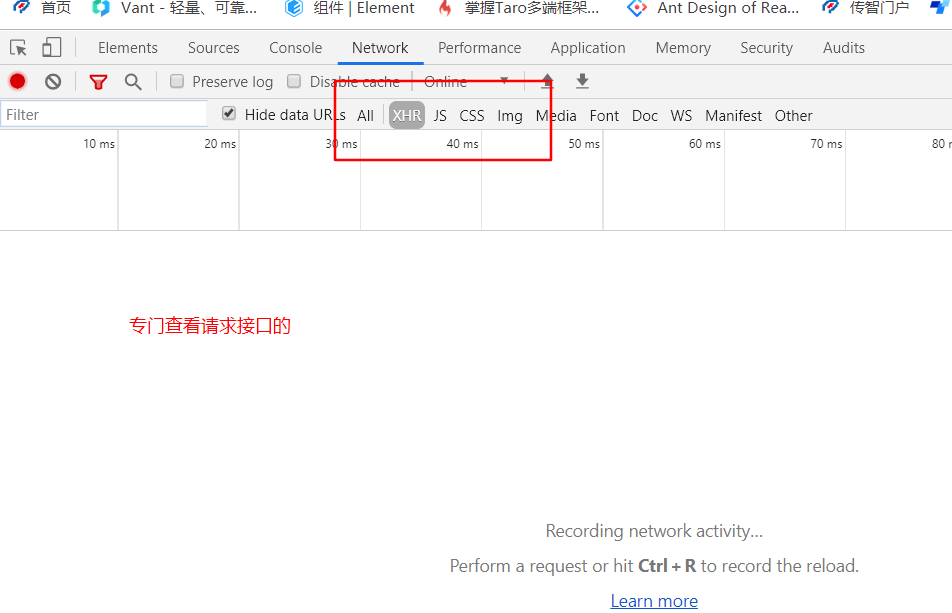
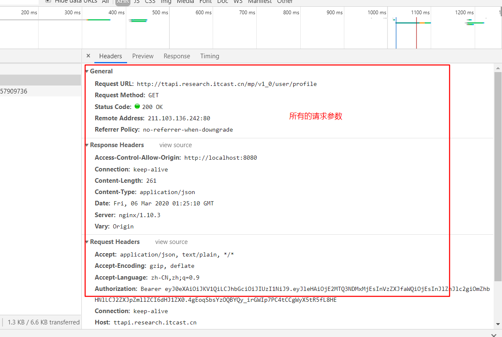
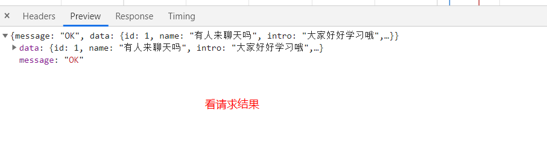

| 姓名 | 意见或建议                                                   |
| ---- | ------------------------------------------------------------ |
| ***  | 要崩溃了，也不知道是哪的问题，一会登录页可以登录上，一会登不上，登不上就提示用户名或密码错误，找了半天错误，哪也没改，就又能登上了，出现好多次，不知道其他同学有没有这情况。求解 |
| ***  | <router-view> 视口标签 要如何布置 根据什么情况要布置？ 迷茫了 做了这么多东西 现在不知为何 开始反思视口标签是如何布置的了 还有router-link知道怎么用 但是不怎么熟悉了 能复习一下吗？ |

## 解决bug 

大部分解决bug , 只会说: 老师,我这不行, 我这出不来, 我这报错 

以上这种描述, 解决不了任何问题,

如果遇到以上问题, 要分析 出错的原因. 

>  循迹模式

根据结果 倒推 过程

页面不显示(结果) =>  很多种 (挨个排查) => 组件没挂上 /地址没写对 /关键字写错了 / 服务没启动 ....

脚手架问题 ...  =>  热更新 => 不用刷新页面 就可以 看到最新的效果 => 本身可能会有热更新的问题 => 重启试试..

数据问题  => 数据是怎么来的 => 查询得来的 / 其他 ..  其他  => 其他的方法 或者逻辑 

查询得来的  => 接口  => 接口返回数据正确与否  =>如果正确 =>  数据回来之后的逻辑   => 不正确 => 看请求逻辑

如果,以上不能看到 问题, 可以在 代码的关键部分 写 debugger,  如果逻辑进入 就可以进入相应的断点

F10是逐语句执行

F11是过程执行

F8 跳过执行

>  

router-view   => 路由组件展示的容器 

>  如果你想展示你的路由组件, 你就需要 一个容器

一级路由组件  需要一级路由容器

二级路由组件 需要二级路由容器 => **`二级路由容器 需要放在 一级路由组件的tempalte中`**

...三级路由组件 需要三级路由容器  => 三级路由容器 需要放在二级路由组件的template中

...

router-link

