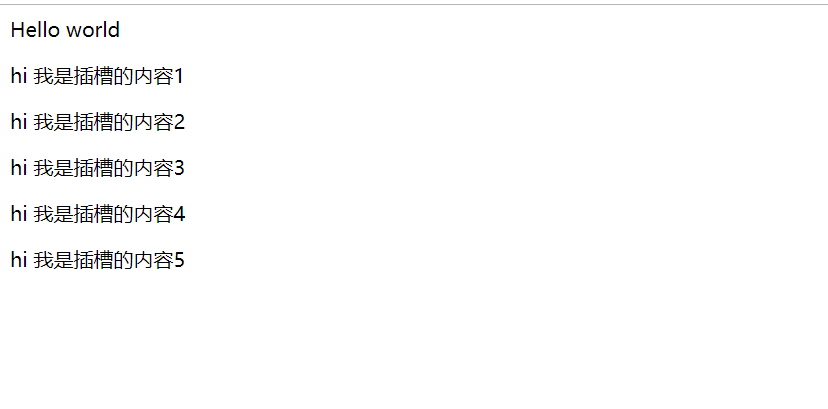
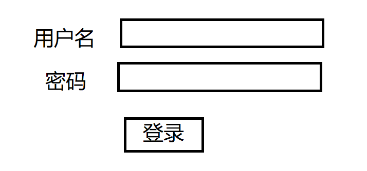

## 黑马头条PC-知识补充-Vue的插槽-默认插槽(匿名)

* **`目标`**掌握什么是插槽, 并且学会使用默认插槽 

* 什么是插槽？

* 我们以前在学习组件的时候 如果要使用一个组件 只需要这样写

  ```xml
  <child></child>   // 使用了一个组件
  ```

  这个组件 的模板内容(template)可能是这样的 

  ```xml
  <div>Hello World</div>
  ```

  我们发现 使用组件时 使用的是标签 标签内部可不可以写一些东西呢

  ```xml
  <child>张三</child>
  ```

  我们在组件标签上写入了一个张三 那么这个张三能显示吗? 答案显示是**`否定`**的 有没有什么办法能够让张三显示?  这个时候我们要用到一个叫做**`插槽`**的概念   我们可以在定义组件的模板中 用到一个**`slot(插槽)`**标签来接收传入的模板内容 如 

  ```xml
  <div>Hello World <slot></slot></div>
  ```

  效果立刻就会出来 

  

  那么 放**`多个插槽`**可不可以?

  ```xml
  <div><slot></slot>Hello World <slot></slot></div>
  ```

  

同样的,不管放置多少个**`slot`**,**`放置slot的位置`**都会将 我们组件标签内部的结构**`替换`**

那么如果child标签里放置多个标签呢?

```xml
<child>
    <p>hi 我是插槽的内容1</p>
    <p>hi 我是插槽的内容2</p>
    <p>hi 我是插槽的内容3</p>
    <p>hi 我是插槽的内容4</p>
    <p>hi 我是插槽的内容5</p>
</child>
```

我们在child标签中放置了多个p标签 来看下效果



发现了吗? 不论放置多少个标签,都会完成**`slot标签的内容`**替换 **`传入的内容`**

以上这种我们在子组件中用**`slot占据位置`**,在父组件中 传入替换内容的方式 就是**`插槽`**

* **`有几个slot标签就有几个坑`**
* **`组件标签传入的内容 会把每个坑填满`**

**`任务`**

1. 定义一个组件 里面静态内容为 
2. * 第一行   我来到 学习前端技术
   * 第二行   在 有很多可爱的同学
   * 第三行   希望离开 时我们能一起吃个饭
3. 使用插槽技术 实现 显示的内容为
   - 第一行   我来到**`黑马`**学习前端技术
   - 第二行   在**`黑马`**有很多可爱的同学
   - 第三行   希望离开**`黑马`**时我们能一起吃个饭

## 黑马头条PC-知识补充-Vue的插槽-后备内容

- **`目标`**掌握插槽的后备内容的使用方式

- 上个小节中,我们学习了**`slot(插槽)`**最基本的使用方式,如果我们在**`组件中定义了插槽`**,就**必须传入内容**,否则组件插槽的位置就会什么都没有. 这样一来,如果 我们有七个组件用的是一个内容,只有第八个组件用的是另一个内容,那么**`同样的插槽内容要写多次`**,这样很傻,也不爽,有没有解决方案?

- **`当然有`**!!  我们可以在定义插槽时,在**`slot(标签)`**中写入**`默认内容`**   如果在传入插槽内容时,内容不为空,那么还会**`按照之前的模式替换`**,如果没传,那么**`默认内容`**就会自动出现**`替换slot`**的位置

- 只要 组件内部传入了内容,slot内部的后备内容就不会显示

- ```xml
  <div>
      Hello world 
      <slot>我是默认的哦</slot>
  </div>
  ```

- 使用组件

- ```xml
  <child></child>  // 什么都不写 页面上就会显示 Hello World 我是默认的哦
  <child>我是新的</child> // 写了内容 页面上就会显示 Hello World 我是新的
  ```

- 如果组件中定义了**`多个slot`**那么有内容部分就显示内容 没内容部分为空

- ```xml
  <div>
      <slot></slot>
      Hello world 
      <slot>我是默认的哦</slot>
  </div>
  // 在使用该组件内容时 如果不传入任何内容  页面上就会显示 Hello World 我是默认的哦
  ```

- **`任务`**

  1. 定义一个组件  内容为 

     

  2. 使用插槽的后备内容实现  

  3. 

## 黑马头条PC-知识补充-Vue的插槽-具名插槽

- **`目标`**掌握Vue具名插槽的使用方式

- 我们已经掌握了插槽的基本用法,上两个小节中 我们传入的**`插槽内容`**都会替换组件定义的**`slot`**,不论我们定义多少个slot,无一例外都会**`同样的内容`**替换掉

- 但是 有一些情况,我们需要传入**`不同的位置的内容`**去替换不同位置的**`slot插槽`**

  ```xml
  <div>
       <slot></slot>
      <p>静态内容</p>
      <slot></slot>
  </div>
  // 我们希望静态内容前面和后面的内容都通过传入的方式接受 但是目前只能接受同样的内容
  ```

  有没有什么办法能实现?

  **`当然有`**!  这个时候我们可以使用**`具名插槽`**的东西来实现 

  我们可以在定义插槽的时候给定义一个**`name`**属性 ,至于值随便取

  ```xml
  <div>
       <slot name='before'></slot>
      <p>静态内容</p>n  
      <slot name='after'></slot>
  </div>
  // 这里我们给两个插槽 定义了不同的name
  ```

  那么怎么传入呢 ?  希望自己的元素被哪个插槽使用 就用slot='插槽名'的方式配置

  ```xml
  <child>
      <span slot='after'>我是after的</span>
      <span slot='before'>我是before的</span>
  </child>
  ```

  **`注意`**这里我们故意把顺序颠倒了  但是效果没有任何影响,说明 具名插槽无关顺序

  具名插槽同样支持**`备用内容`**,不传入插槽内容 则显示插槽内部的内容
  
  **`任务`**
  
  1. 实现一个组件  背景色为红色
  2. 定义header  body  footer 具名插槽
  3. 实现 第一个组件实例 header 高 20px  背景色 蓝色    body内容为 白色字体的 我是body  footer为 绿色字体的 我是footer
  4. 第二个实例  header  高 40px  背景色  黄色   body内容为  绿色字体的 我是body  footer为白色的字体的 我是footer

## 黑马头条PC-知识补充-Vue的插槽-作用域插槽

- **`目标`**掌握Vue插槽的使用-作用域插槽

- 在以上几个小节中,我们在传入插槽内容时 没有用动态变量 如果用了会怎样?

- ```xml
  <child>
      {{name}}
  </child>
  ```

  **`注意`**上面代码中的**`name`**读取的是父组件的变量, 和child组件没有任何关系,假如 在child组件中定义了一个属性name,父组件中同样有属性name,这个时候读取的一定是父组件的**`name`**属性

  请记住

  > 父级模板里的所有内容都是在父级作用域中编译的；子模板里的所有内容都是在子作用域中编译的。

  但是!!!!   如果我想读取**`子组件中的name`**需要怎么做呢 ? 能做吗?

  **`当然可以!`**

  首选 我们希望 子组件中的name被父组件读取到,要先在**`定义插槽`**的位置 ,将name传递出来,怎么传呢?

  ```xml
  <div>
      Hello World 
      <slot v-bind:name1='name'></slot>
  </div>
  ```

  **`注意`** 我这里特意用了**`name1`**,为啥呢? 还记得 我们上一小节中讲到的**`具名插槽`**吗?定义具名插槽也是通过name属性,所以name成了关键字,不能用**`name`**!!!!!

  这里我们实现了将name的值给了一个叫做name1的属性名,那么怎么在父组件中接收呢?

  ```xml
  <child>
      <span slot-scope='obj自定义对象名'></span>
</child>
  ```
  
  大家看,我们在span标签上定义了一个叫做 **`slot-scope(作用域插槽)`**的属性 后面跟着的是我们随意定义的对象名**`obj`**, 我们前面定义的**`name1`**就被放入到我们的**`obj`**中, 我们就可以通过obj.name1取到值
  
  ```xml
  <child>
      <span slot-scope='obj'>{{obj.name1}}</span>
  </child>
  ```
  
  **`任务`**
  
  1. 定义一个子组件 组件中的list数据为 ["北京","上海","天津"]  name数据为 Hello world
  2. 定义具名插槽 header 和 body 
  3. header插槽中读取 子组件中的name  颜色为红色 字体大小48px  
  4. body插槽中遍历 子组件中的list 

