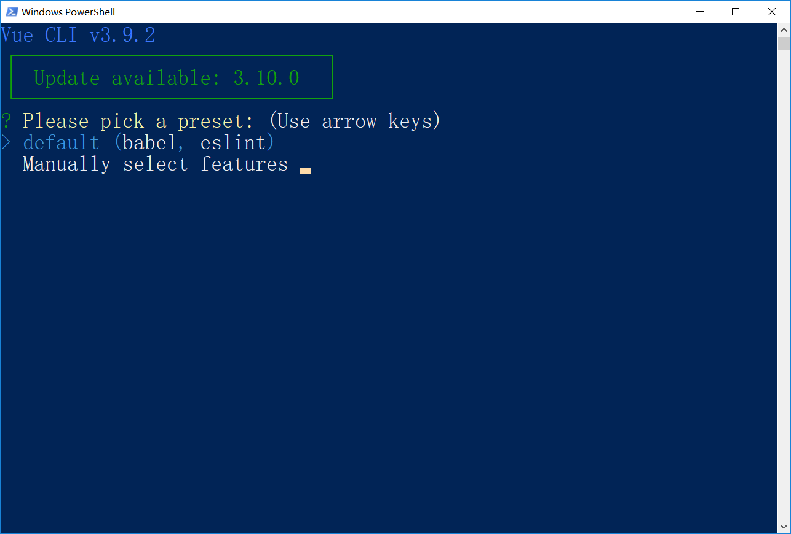
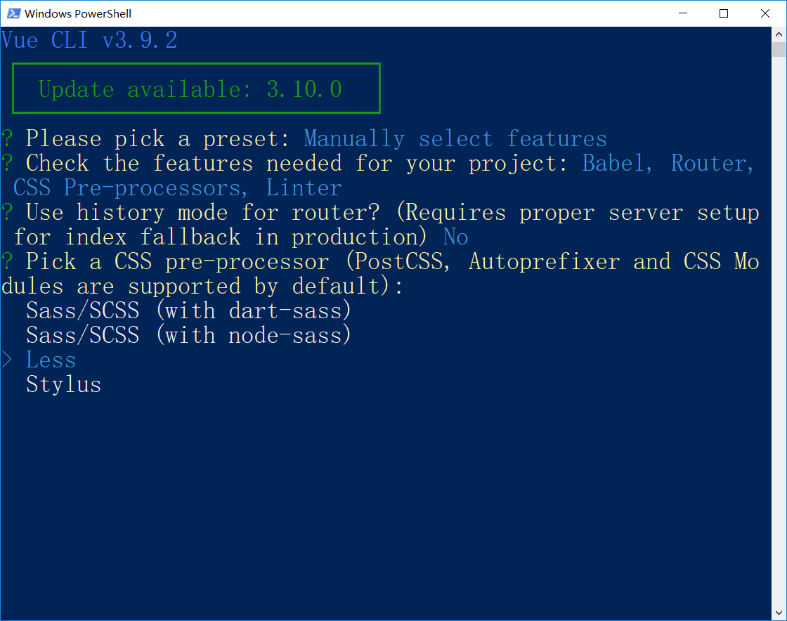
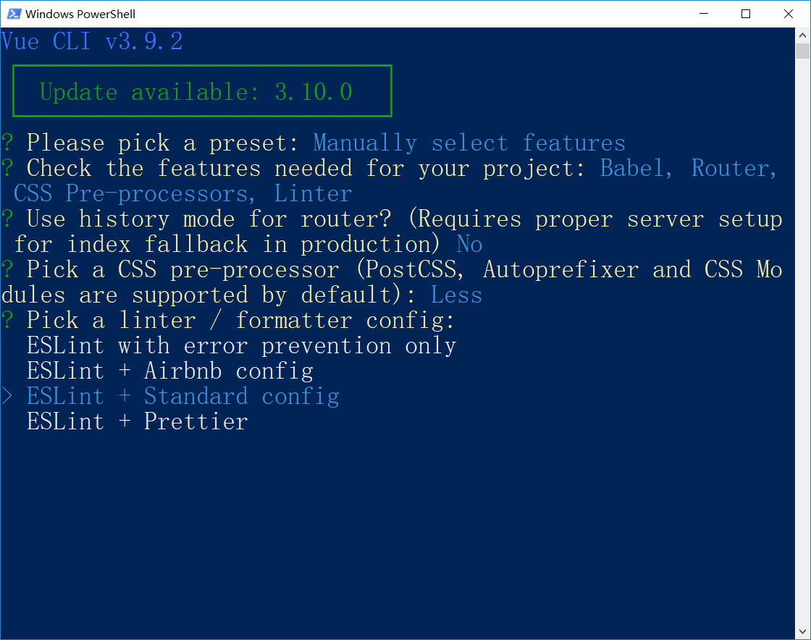
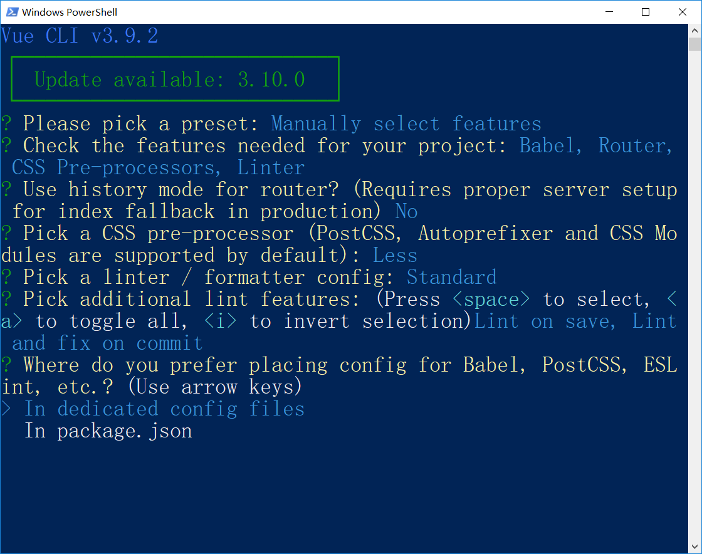
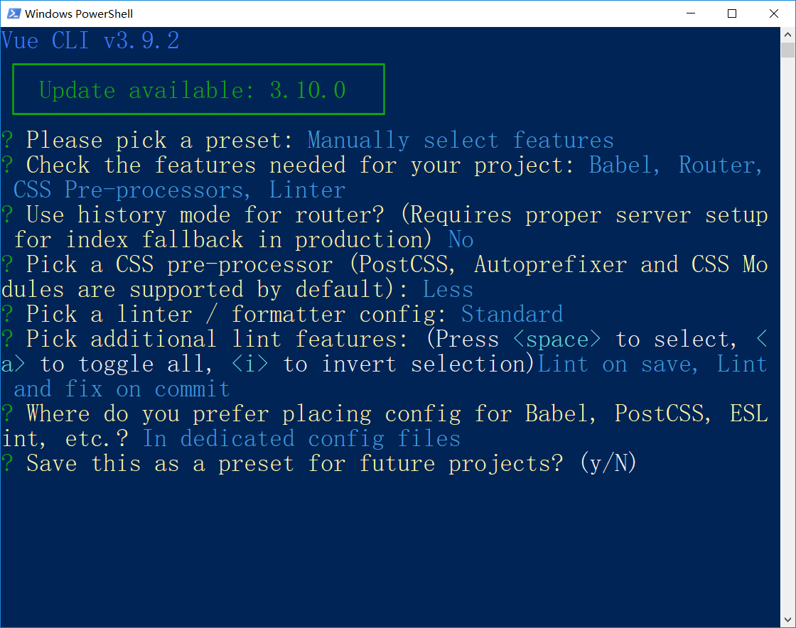

##  黑马头条PC-我们要做什么?

**`目标`**对于黑马头条的项目进行演示及介绍

* 一个类似于[今日头条自媒体头条号](<http://mp.toutiao.com/profile_v3/index>)的后台管理系统。
* SPA应用
* [黑马头条PC线上地址](http://ttmp.research.itcast.cn/#/login)
* 演示项目效果

## 黑马头条PC-项目账号怎么来?

**`目标`** 如何拥有一个黑马头条的账号

* [黑马头条客户端地址](http://toutiao.research.itcast.cn/#/login)
* 你需要在这个地址上输入自己的**手机号** **验证码(246810)** 
* 以上操作便完成了注册操作 
* 再回到PC页面 使用 刚才注册用的**手机号**和**验证码(246810)**即可完成登录
* 13911111111(系统账号)
* 246810

139的系统账号 可以 **`发表正式数据`**

**`任务`**注册一个自己的黑马头条账号,并浏览相关页面

## 黑马头条PC-我们用什么技术做

**`目标`** 了解 在黑马头条项目中需要应用的技术

- [Vue.js](<https://cn.vuejs.org/>)   ==>> MVVM框架
- [Vue Router](<https://router.vuejs.org/>)  ==> 实现Vue项目的前端路由功能
- [Vue CLI](<https://cli.vuejs.org/>)   ==> Vue项目的脚手架工具4.0
- [Vuex](<https://vuex.vuejs.org/zh/>) ==> 状态共享框架(**`略难理解`**,根据情况) => PC项目不做 =>移动端Vuex
- eventBus ==> **`Vuex的替代方案`**(根据课程吸收情况) 子组件 => 父组件 $emit()
- [axios](<https://github.com/axios/axios>)  ==> 请求工具 (拦截请求)
- [ElementUI](<https://element.eleme.io/>)  ==> Vue前端UI框架 (**`极其重要`**的知识点  工作几乎每天都用)
- [Echarts](<https://echarts.baidu.com/>) ==> 第三方图表插件 (强大的图表插件 可在Vue中集成) 百度出品
- [nprogress](<https://github.com/rstacruz/nprogress>)  ==>  第三方进度条(用来美化前端的页面跳转)
- [Quill](<https://github.com/quilljs/quill>) ==> Vue第三方插件(富文本编辑器)
- [Eslint](https://cn.eslint.org/docs/user-guide/getting-started)  ==> 语法校验辅助工具(它的目标是保证**`代码的一致性`**和**`避免错误`**)


* 结论
* 需要重点掌握 通过**`vue-cli4.0`**初始化项目
* 使用**`vue-router`**配置前端路由
* 使用**`axios`**进行数据请求
* 重点掌握 **`ElementUI`**在项目中的应用

**`任务`**查阅以上各个技术的官网文档,对各个技术有个初步了解

## 黑马头条PC-知识补充-ElementUI-介绍和安装

**`目标`**掌握如何在Vue-cli项目中安装ElementUI框架

[ElementUI文档地址](https://element.eleme.cn/#/zh-CN/component/installation)

Element-UI 是 饿了么 前端团队，开源出来的一套 Vue 组件库(针对pc电脑浏览器端)，内部集成了许多项目中可以使用的成熟`组件component`，既增强了用户体验、又加快的开发速度。

* 安装elementUI的方式 分为**`两种`**, 一种在vue-cli脚手架项目中,一种是在页面中**`直接引入`**,这推荐在spa项目中使用**`npm`**直接安装使用

> 知识补充 npm  i  包名  安装依赖

依赖分为两种 => 1. 开发时依赖 2. 运行时依赖

脚手架  =>  前后端项目 => 开启一个服务 => 调试开发 =>  完成 => 上线  =>只上线编译之后 html +js +css

只在开发调试期间 为我们提供帮助的依赖 叫做开发时依赖 => 脚手架 / webpack / 代码辅助工具(eslint) 

> 安装开发时依赖  =>  **`npm  i  包名   => 默认装到 运行时依赖`** => **`npm i  包名 -D`**  或者 **`npm i  包名 --save--dev`** =>  开发时依赖的包 存于   **`devDependencies`**
>
> 运行时依赖 如果你项目上线 依然需要在项目中使用的 依赖包   npm i  包名 (运行时依赖 )

> **`npm  i  包名 -S`** 或者 **`npm i  包名 --save`**      运行时依赖 存于  **`dependencies`**

* 除了npm之外, 还有 其他的包管理工具  比如yarn

> 需要注意的是:  **`不要 npm 和 yarn 混用一个项目`**

1. 执行指令安装组件库

   ```bash
   $ npm i element-ui -S  # 装到运行时依赖
   ```

2. 在main.js文件中引入elementui模块和注册

3. ```js
   import Vue from 'vue';
   import ElementUI from 'element-ui';
   import 'element-ui/lib/theme-chalk/index.css';
   import App from './App.vue';
   
   Vue.use(ElementUI);
   
   new Vue({
     el: '#app',
     render: h => h(App)
   });
   ```

4. 

5. 

   

6. 在任意位置使用elementUI组件

   

7. 运行效果

   


**`任务`**

1. 通过vue-cli4.0初始化一个Vue项目
2. 在项目中安装ElementUI 并完成框架的注册
3. 在App.vue组件中 任意应用一个ElementUI组件

## 黑马头条PC-初始化项目-VueCli4.0配置项目

**`目标-任务`** 通过vue-cli4.0初始化一个黑马头条项目  

* 注意: 前期只是为了展示和快速开发,我们基本采用了默认设置,这节课我们来进行一下个性化配置

1. 初始化一个项目(4.0)

   ```bash
   $ vue create 94-toutiaopc
   ```

2. 创建之后会得到如下图形

3.  

`default（babel，eslint）`：默认的配置

`Manually select features`：手动选择功能特性配置项

> 我们这里选择第2种，支持更多的自定义选项。


使用键盘上下箭头进行移动，使用空格切换选中与否。

`Babel`：将 ECMAScript  6 转 ECMAScript 5用的一个工具

`Router`：Vue Router 路由

`CSS Pre-processors`：CSS预处理器（SASS、Less、Stylus。。。。）

`Linter / Formatter`：代码校验和格式化

勾选好以后，回车进入下一步。


选择路由模式

路由路径有两种模式：

- hash锚点模式：`http://协议:端口号/path路径/#/路由路径`
  - 简单，兼容好
- history模式：`http://协议:端口号/路由路径`
  - url简洁
  - 兼容差，需要额外的服务器配置

我们这里输入 `n` ,使用默认的路由模式。 回车进入下一步



选择 CSS 预处理器

这里我们选择使用熟悉的 Less 预处理器。回车下一步



选择代码格式校验风格

JavaScript 代码风格不是固定的，社区中有几种比较推荐的格式。

Airbnb 制定的 JavaScript Style

[JavaScript Standard Style](<https://standardjs.com/readme-zhcn.html>)

这里我们选择 `ESLint + Standard config` 模式。


选择代码格式校验方式

`Lint on save`：每当代码文件保存的时候进行格式校验。

`Lint and fix on commit`：当执行 git commit 代码提交的时候进行校验和尝试自动修复校验失败的语法格式，如果校验失败并且自动修复也失败，就无法完成代码提交。你需要手动解决了代码格式问题然后重新提交，这样就确保版本历史中的代码一定没有代码格式问题。



VueCLI 会在项目中生成一些工具的配置文件。配置文件可以存储在两个地方：

`In dedicated config files`：生成独立的配置文件，推荐，维护方便

`In package.json` 混到 package.json 文件中，不推荐，维护麻烦

这里我们选择第1种，将这些工具的配置文件保存到独立的配置文件中，方便查看和修改。



你可以把你刚才那些选择配置项保存为一个模板，下次使用 `vue create` 创建项目的时候它会提示你是否可以使用这个选择模板直接创建你的项目。

如果你需要，就输入 `y`，然后它会让你给这个模板起个名字，下次就可以直接使用；

如果不需要，就输入 `n`，继续下一步。

这里我们不需要，输入 `n` 继续下一步。


> 到这里，自定义配置项就完成了，Vue CLI 开始根据你的选择创建项目并安装项目依赖的第三方包。


> 安装结束，根据在终端中的提示执行以下命令：
>
> ```bash
> $ cd 项目目录
> $ npm run serve
> ```
>
> 

> 启动成功

按照给出的地址，在浏览器中访问测试。


**`任务`** 根据以上步骤完成 黑马头条项目的初始化

## 黑马头条PC-知识补充-ESlint

- **`目标`**了解什么是ESlint 如何在VSCode中配置ESlint

- ESlint**：是用来统一**JavaScript**代码风格的工具，**不包含css、html等**。

  我们项目中使用的是 [JavaScript Standard Style](<https://standardjs.com/readme-zhcn.html>) 代码风格。下面是它的一些具体规则要求：

  - **使用两个空格** – 进行缩进 

  - **字符串使用单引号** – 需要转义的地方除外

  - ```js
    var a = 'hello world'
    ```

  - **不能有未使用的变量**    

  - **代码结尾无分号无空格**

  - **关键字后加空格** `if (condition) { ... }`

  - **函数名后加空格** `function name (arg) { ... }`

  - 对象 **成员名称******冒号**** 与 **值** 之间需要有一个空格   {name: '张三'}

  - 坚持使用全等 `===` 摒弃 `==` 一但在需要检查 `null || undefined` 时可以使用 `obj == null`。

    .....

  

说了那么多，看看[这个遵循了 Standard 规范的示例文件](https://github.com/expressjs/body-parser/blob/master/index.js) 中的代码吧。或者，这里还有[一大波使用了此规范的项目](https://raw.githubusercontent.com/standard/standard-packages/master/all.json) 代码可供参考。

如果你不认识命令行中的语法报错是什么意思，你可以根据错误代号去 ESLint 规则列表中查找其具体含义。

### 如何应用ESlint

**`目标`** 在eslint中应用eslint

 目前有两种方式 应用eslint  

- 一种是**`编辑器`**中可以加入ESLint插件,在编写代码时 进行检查 并且自动修正 (辅助工具)

  - 一种是在各种框架的**`脚手架`**上 加入了 **`eslint`**检查  一般用于**`代码检查`**和**`提交校验`**

- 如何在VSCode中配置ESlint

- **第一步** 在VSCode插件中 查找ESLint插件 **`安装`**并启用

- 

- **第二步**  打开vscode配置文件 settings.json  (by File-> Preferences->Settings)

  在最末尾如下内容

  ```json
  "eslint.enable": true,
      "eslint.run": "onType",
      "eslint.options": {
          "extensions": [
              ".js",
              ".vue",
              ".jsx",
              ".tsx"
          ]
      },
      "editor.codeActionsOnSave": {
          "source.fixAll.eslint": true
      },
  ```

> 按照上面的步骤操作之后, 还需要注意,eslint插件本身的**`修复功能`** 可能会和 vscode 其他插件 **`冲突`**

所以我们需要将其他 自动格式化代码的插件**`禁用掉`**,  将**`保存格式化 选项`**设置为false

> 注意: eslint 只能在拥有eslint配置文件的项目中 拥有校验作用, 之前的英雄列表中并没有eslint, 所以不起作用


## 黑马头条PC-初始化项目-项目目录介绍

**`目标`**初始化项目的目录进行简单认识

```
│  .browserslistrc 该文件会被 Babel 和 Autoprefix 用来根据浏览器的版本确定需要转译的 JavaScript 特性和 CSS 浏览器前缀
│  .editorconfig 编辑器配置文件，编辑器会根据该文件选择编辑格式
│  .eslintrc.js ESLint配置文件
│  .gitignore Git忽略配置文件
│  babel.config.js Babel转码工具配置文件  babel 有 两种配置文件  .babelrc / babel.config.js
│  package-lock.json 包管理工具的锁定文件  帮助我们锁定版本 解决团队开发时 版本冲突问题
│  package.json	包说明文件
│  postcss.config.js	postcss配置文件
│  README.md 说明文档
│  
├─node_modules 第三方包
├─public 公共资源目录
│      favicon.ico
│      index.html
│      
└─src 源码目录
    │  App.vue 根组件
    │  main.js 入口模块
    │  router.js 路由模块
    │  
    ├─assets 静态资源目录
    │      logo.png
    │      
    ├─components 非路由组件目录
    │      HelloWorld.vue
    │      
    └─views 路由组件目录
            About.vue
            Home.vue
```

通过代码发现 main.js为整个项目的总入口文件

```js
import Vue from 'vue'
import App from './App.vue'
import router from './router'

Vue.config.productionTip = false

new Vue({
  router,
  render: h => h(App)
}).$mount('#app')
// 在这里完成了 Vue的实例化 并且已经挂载了路由 
```

**`注意`**这里的app.vue实际上为整个项目的根组件 

```xml
<template>
  <div id="app">
    <div id="nav">
      <router-link to="/">Home</router-link> |
      <router-link to="/about">About</router-link>
    </div>
    <router-view/>
  </div>
</template>
```

我们发现根组件中放入了导航和路由的承载容器 接着我们查看路由的配置文件

```js
import Vue from 'vue'
import Router from 'vue-router'
import Home from './views/Home.vue'

Vue.use(Router)

export default new Router({
  routes: [
    {
      path: '/',
      name: 'home',
      component: Home
    },
    {
      path: '/about',
      name: 'about',
      // route level code-splitting
      // this generates a separate chunk (about.[hash].js) for this route
      // which is lazy-loaded when the route is visited.
      component: () => import(/* webpackChunkName: "about" */ './views/About.vue')
    }
  ]
})

```

我们发现了一种**`新的组件引用方式`**  


```js
component: () => import(/* webpackChunkName: "about" */ './views/About.vue')
```

**`注意`**: 我们曾经说过spa首屏渲染时会将所有模板的代码都**`一次性`**加载到页面上造成**`首屏加载缓慢`**, 并且提到了一种**`按需加载`**的引用方式,OK,上面这种方式就是**`按需加载`**,只有用到该组件的时候,该组件模块才会被加载到页面上,节省了多余的资源

按需加载 => 只有需要访问的时候 才进行js的请求,否则不请求

**`任务`**查阅以上模块内容,理解以上代码行为.

## Yarn的安装命令及介绍

> yarn 和 npm  都是包的管理工具 

npm  存在一些问题 ,yarn是对npm的一些补充和升级

**1.初始化一个新的项目**

```bash
$ yarn init
```

**2、添加一个依赖包**

```bash
$ yarn add [package]  #安装一个包
$ yarn add [package]@[version] @ #安装对象版本的包
$ yarn add [package]@[tag]
```

**3、安装所有的依赖包**

```bash
$ yarn 
$ yarn install
```

**`npm 与 yarn命令比较`**

| NPM                        | YARN                      | 说明                                   |
| :------------------------- | :------------------------ | :------------------------------------- |
| npm init                   | yarn init                 | 初始化某个项目                         |
| npm install/link           | yarn install/link         | 默认的安装依赖操作                     |
| npm install taco —save     | yarn add taco             | 安装某个依赖，并且默认保存到package.   |
| npm uninstall taco —save   | yarn remove taco          | 移除某个依赖项目                       |
| npm install taco —save-dev | yarn add taco —dev        | 安装某个开发时依赖项目                 |
| npm update taco —save      | yarn upgrade taco         | 更新某个依赖项目                       |
| npm install taco --global  | yarn global add taco      | 安装某个全局依赖项目                   |
| npm publish/login/logout   | yarn publish/login/logout | 发布/登录/登出，一系列NPM Registry操作 |
| npm run/test               | yarn run/test             | 运行某个命令                           |

> 如果你的项目 的node_modules 一开始用yarn进行了安装依赖,那么以后安装某个依赖包 最好用yarn
>
> 如果你的项目 的node_modules 一开始用npm进行了安装依赖,那么以后安装某个依赖包 最好用npm

> 不要 前边用npm 后面用yarn,容易造成一些包的丢失


## 未来两个项目的 开发模式

> 老高 会在 自己的git上新建一个项目仓库, 每天的课程 按照 章节的模式提交,
>
> 做一小节 提交一次

> 同学们, 拉取老高的代码,看笔记, 根据代码和笔记, 新建自己的仓库, 每天按照章节的模式 将每天的代码提交

提交到同学自己的仓库


## 黑马头条PC-初始化项目-git管理

- **`目标-任务`**在github建立一个远程仓库,并将新建的代码推到远程仓库上
- - 真正的项目开发都是采用git/svn管理的  
  - 以后每天的模块增加 修改 删除 都会以git提交的方式 推送给同学们

1. 新建git远程仓库 

- 首先需要有一个github的账号 然后登陆github官网 进行新建远程仓库操作

2. 完成初始提交

> git remote -v  查看当前本地项目和远程仓库的连接

```bash
$ git remote add origin <远程仓库地址>
$ git push -u origin master  // -u 的意思是 记录当前的推送信息
```

之后开发的过程如果需要提交历史记录：

```bash
$ git add .  
$ git commit -m "log日志"
```

推送的时候如果不改变远程仓库和分支的话就直接：

```bash
$ git push  
```


> 注意:  如果在https情况下, 推送的时候 每次都让你输入密码 和用户名  有可能是因为  [原因](https://blog.csdn.net/qq_34306360/article/details/80275277)


## 黑马头条PC-初始化项目-安装ElementUI

- **`目标-任务`**在新建的项目中 安装elementUI 并提交git

- 安装

  - ```bash
    $ npm install element-ui --save  # 安装到运行时依赖
    ```

  - 在main.js文件中引入elementui模块和注册

    ```js
    import Vue from 'vue'
    import App from './App.vue'
    import router from './router'
    import ElementUI from 'element-ui'  // 引入UI
    import 'element-ui/lib/theme-chalk/index.css' // 引入样式
    Vue.config.productionTip = false
    Vue.use(ElementUI)
    new Vue({
    router,
    render: h => h(App)
    }).$mount('#app')
    ```

## 黑马头条PC-初始化项目-整理目录-准备资源

- **`目标-任务`** 清理项目中无用的文件,并导入图片资源 到assets目录下  初始化引入一个index.less文件 
- views一般放置 **`路由级组件`**,就是直接挂到路由表的component的组件,相当于我们原来**`一个个页面`**
- 路由级组件里面 **`引用的其他组件`**一般放在components下 ,这样更规范
- 1. 清理无用的*.vue文件 
- 2. 导入准备好的图片资源
- 3. 在main.js中引入 一个index.less此样式文件的意义是 对于全局样式的设置 例如 margin padding的初始化配置
- 4. 提交git

结论: 此步骤的目的是准备好 开发资源 下一步做好准备

