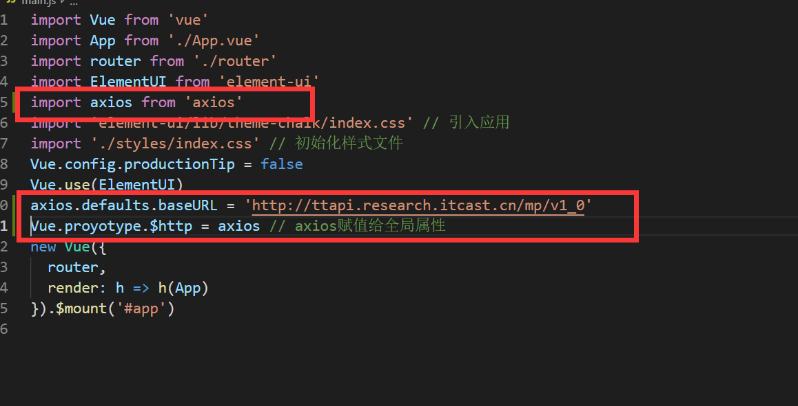

## 黑马头条PC-初始化项目-页面分析-新建登录和主页

- **`目标-任务`** 对具体的页面模块路由进行分析,并在路由中加入新建登录页面 +
- 
- 我们访问第一次会进入登录页面  得出 **`登录页`**是**`整个项目的入口页面`**, 登录页肯定属于一级路由
- 进入主页后 我们发现 页面出现了**`三个区域`**  其中中间区域的内容切换菜单时 会发生变化,所以判断 主页存在**`二级路由`**

**`结论`**:通过以上得出结论,  **`登录页`** 和 **`主页`**都为一级路由,主页下 存在**`二级路由`**

根据一级路由和二级路由关系设计以下路由表

| path           | 功能     | 备注           |
| -------------- | -------- | -------------- |
| /login         | 登录     | **`一级路由`** |
| /home          | 首页     | **`一级路由`** |
| /home/publish  | 发布文章 | 二级路由       |
| /home/articles | 文章列表 | 二级路由       |
| /home/comment  | 评论     | 二级路由       |
| /home/material | 素材     | 二级路由       |
| //home/fans    | 粉丝     | 二级路由       |
| /home/account  | 个人设置 | 二级路由       |

-  新建一个login组件和home组件,并配置路由表,在页面显示,提交git
- import login from './login ' //简写模式
- import login from './login/index.vue ' // 完整模式

## 黑马头条PC-登录模块-页面布局及样式

- **`目标-任务`**完成登录页的布局及开发
- **`注意`**千人千面,每个前端程序员对于样式的实现方式都不一样,手法和手段各有不同,但是目标都是写出精美的页面. 
  - 既然我们选择使用elementUI框架,那么任何样式布局的东西都可以先在element中寻找是否有适合的
- 登录实际是个表单 我们可以在ElementUI提供的表单类组件中寻找可使用的组件
- 表单 => 提交数据 ,校验数据 => elementUI表单

**`补充知识点`** 

在单文件组件中,如果需要在style标签中使用 诸如 **less** **scss**  需要在style标签上 给lang属性赋值 如图


**`scoped属性`**

默认情况下，vue单文件组件的style样式是[全局的]()，

如果在一个应用中使用了**多个**单文件组件，它们使用<span style="background-color:yellow;">相同选择器</span>为相同的元素设置了style样式，那么只有一个会起作用(**后者会覆盖前者**), 样式会冲突

**解决方法**：

如果加了**`scoped`**属性,那么当前组件的样式 **`只对当前自己的html`**起作用

给每个style标签都设置一个`scoped`属性，这样各个单文件组件的html标签解析出来后都会带有一个与其他单组件标签不同的`data-v-xxx`的唯一属性，style样式设定也会自动与本身组件的`data-v-xxx`联系起来，这样就使得style样式只针对自己的组件起作用了

> 开始实施 登录页的布局

登录页实际采用组件

表单 => 采集数据 ,校验数据

* **`el-form`**是表单的容器 ,如果要放置表单, 需要放置在**`el-form`**里面
* 如果 要放置一个input组件到表单 =>  需要放置在**`el-form-item`**里面

- [el-card](https://element.eleme.cn/#/zh-CN/component/card)
- [el-form](https://element.eleme.cn/#/zh-CN/component/form)
- [el-form-item](https://element.eleme.cn/#/zh-CN/component/form)
- el-button
- el-input
- el-checkbox
- 页面内容

```xml
<div class="login">
    <!-- 放置一个el-card组件 -->
    <el-card class='login-card'>
      <!-- 放置标题图片 -->
      <div class='title'>
        
      </div>
      <!-- 放置表单 -->
      <el-form>
        <!-- 表单域 里面   放置 input/select/checkbox 相当于一行-->
        <el-form-item>
           <el-input placeholder="请输入手机号"></el-input>
        </el-form-item>
        <!-- 表单域 -->
        <el-form-item>
          <el-input style="width:65%" placeholder="验证码"></el-input>
            <el-button style="float:right" plain>发送验证码</el-button>
        </el-form-item>
        <el-form-item>
          <!-- 复选框 -->
          <el-checkbox>我已阅读并同意用户协议和隐私条款</el-checkbox>
        </el-form-item>
        <el-form-item>
          <el-button type="primary" style="width:100%">登录</el-button>
        </el-form-item>
      </el-form>
    </el-card>
  </div>
```

页面样式

```less
.login  {
    background-image: url('../../assets/img/back.jpg');
    height: 100vh;
    background-size: cover;
    display: flex;
    justify-content: center;
    align-items: center;
    .login-card {
      width: 440px;
      height: 350px;
      .title {
        text-align: center;
        margin-bottom: 30px;
        img {
          height: 45px;
        }
      }
    }
  }
```

最终实现效果


## 黑马头条PC-登录模块-数据绑定及校验

**`目标-任务`**完成登录模块的表单数据绑定及数据校验-实现点击登录对手机号和验证码的验证

* 表单校验-两种-**`自动校验`**(校验单个表单数据)-**`手动校验`**-提交整个表单时,校验整个表单数据
* 数据校验 => el-form组件绑定 **`model`**属性 => 数据对象  给el-form绑定**`rules`**规则  给form-item配置**`prop`**,prop是校验的字段名(只写字段名)
* 通过采用elementUI的组件进行页面的渲染 绑定数据同样需要根据elementUI要求
* Form 组件提供了表单验证的功能，只需要通过 `rules` 属性传入约定的验证规则，并将 Form-Item 的 `prop` 属性设置为需校验的字段名即可。校验规则参见 [async-validator](https://github.com/yiminghe/async-validator)
* **el-form** 中的 **`model`**属性绑定表单数据对象
* **el-form** 中的 **`rules`**属性绑定数据的校验规则
* **el-form-item** 中的**`prop`**属性 写上 下面表单组件的字段名
* 数据的双向绑定 => v-model 
* required只校验 null  '' undefined 和空字符串 ,但是不校验false/true

| 规则            | 说明                                                         |
| --------------- | ------------------------------------------------------------ |
| type(可不填)    | 指定要检验的字段的类型                                       |
| **`required`**  | 必填项,如果不填 就无法通过校验/如果为true,就表示该字段必填   |
| **`validator`** | **`自定义校验函数`**                                         |
| **`message`**   | 当不满足设置的规则时的提示信息                               |
| **`pattern`**   | 正则表达式                                                   |
| range           | 使用min和max属性定义范围。对于字符串和数组类型，将根据长度进行比较，对于数字类型，数字不得小于min，也不得大于max。 |
| len             | 要验证字段的确切长度，请指定len属性。对于字符串和数组类型，对length属性执行比较，对于数字类型，此属性指示数字的完全匹配，即，它可能仅严格等于len。如果len属性与最小和最大范围属性组合，则len优先。 |
| enum            | 要从可能值列表中验证值，请使用带枚举属性的枚举类型，列出该字段的有效值，例如： var descriptor = {   role: {type: "enum", enum: ['admin', 'user', 'guest']} } |

如果数据校验不满足 还可以自定义校验函数 **`validator`**

**`validator`**是一个函数, 其中有三个参数 (**`rule`**(当前规则),`value`(当前值),**`callback`**(回调函数))

```js
var  func = function (rule, value, callback) {
    // 根据value进行进行校验 
    // 如果一切ok  
    // 直接执行callback
    callback() // 一切ok 请继续
    // 如果不ok 
    callback(new Error("错误信息"))
}
```


最终模板代码

```xml
 <div class='login'>
      <!-- 使用elementUI组件 el-card -->
     <el-card class="login-card">
         <!-- 匿名插槽 -->
         <div  class='title'>
             
         </div>
         <!-- 表单 => el-form包裹 -->
         <!-- 数据校验 => el-form绑定 model ,绑定rules规则 -->
         <el-form ref="myForm" :model="loginForm" :rules="loginRules" style="margin-top:20px">
             <!-- 每一个表单域由一个 Form-Item 组件构成 -->
             <!-- form-item  prop属性 绑定 下面表单组件的 字段名 -->
             <el-form-item prop="mobile">
                 <!-- 表单域中可以放置各种类型的表单控件，包括 Input、Select、Checkbox、Radio、Switch、DatePicker、TimePicker -->
                 <!-- 手机号 绑定 v-model -->
                 <el-input v-model="loginForm.mobile" placeholder="请输入手机号"></el-input>
             </el-form-item>
             <el-form-item prop="code">
                 <!-- 验证码 -->
                 <el-input v-model="loginForm.code" placeholder="请输入验证码" style="width:65%"></el-input>
                 <!-- 发送验证码 -->
                 <el-button  style="float:right">发送验证码</el-button>
             </el-form-item>
             <el-form-item prop="agree">
                 <!-- 同意选项 -->
                 <el-checkbox v-model="loginForm.agree">我已阅读并同意用户协议和隐私条款</el-checkbox>
             </el-form-item>
              <el-form-item>
                  <!-- 登录按钮 -->
                  <!-- 注册点击事件 -->
                  <el-button @click="login"  type="primary" style="width:100%">登录</el-button>
              </el-form-item>
         </el-form>
     </el-card>
  </div>
```

最终js代码

```js
export default {
  data () {
    let validator = function (rule, value, callBack) {
      // rule当前规则
      // value当前表单项的值
      // callback 回调函数
      // 正常写法
    //   if (value) {
    //     // 正确 勾选了协议
    //     callBack() // 一切OK请继续
    //   } else {
    //     // 不对 没勾选协议
    //     callBack(new Error('您必须同意无条件被我们蒙骗'))
    //   }
      value ? callBack() : callBack(new Error('您必须同意无条件被我们蒙骗')) // 炫技模式
    }
    return {
      // 表单数据 是一个对象
      loginForm: {
        mobile: '', // 手机号
        code: '', // 验证码
        agree: false // 是否同意协议
      },
      loginRules: {
        //   决定着校验规则  key(字段名):value(对象数组) => 一个对象就是一个校验规则
        // required 为true 就表示该字段必填 如果不填 就会提示消息
        mobile: [{ required: true, message: '请输入您的手机号' },
          { pattern: /^1[3456789]\d{9}$/, message: '请输入合法的手机号' }],
        code: [{ required: true, message: '请输入您的验证码' },
          { pattern: /^\d{6}$/, message: '验证码为6位数字' }],
        agree: [{ validator }]
      } // 登录规则集合对象
      // 自定义形式去校验
    }
  },
  methods: {
    login () {
      // 校验整个表单的规则
      // validate 是一个方法 => 方法中传入的一个函数 两个校验参数  是否校验成功/未校验成功的字段
      this.$refs.myForm.validate(function (isOK) {
        if (isOK) {
          console.log('校验成功')
        }
      })
    }
  }
}
```

结论: 用到的**正则表达式**

手机号: **/^1[3456789]\d{9}$/**

6位数字:**/^\d{6}$/**

* el-form  需要绑定model,需要规则rules 
* el-form-item 需要prop属性 需要绑定校验的字段 
* rules规则 => required必填 pattern正则表达式 message 提示信息 
* 自定义校验函数 validator  => rule,value,callback =>  callBack() / callBack(new Error(错误信息))

## 黑马头条PC-登录模块-安装axios-配置全局使用

**`目标-任务`** 将axios安装在当前项目中,并将其赋值给全局对象,在任何位置都可以访问 并配置baseUrl

* 登录需要接口访问,访问工具推荐 axios

* axios 安装到运行依赖

  ```bash 
  $ npm i axios -S
  or 
  $ npm install axios --save
  ```

* 引入axios 配置baseUrl

* 在main.js中引用 并赋值给Vue的原型属性

* 

## 黑马头条PC-登录模块-登录请求-返回值中token解析

**`目标-任务`** 通过axios调用登录接口,得到登录返回值 分析返回值意义

```js
     this.$http
        .post('/authorizations', this.formData)
        .then(result => {
            console.log(result)
        })
```

**得到的数据结果**:

<table>
  <thead class="ant-table-thead">
    <tr>
      <th key=name>名称</th><th key=type>类型</th><th key=required>是否必须</th><th key=default>默认值</th><th key=desc>备注</th><th key=sub>其他信息</th>
    </tr>
  </thead><tbody className="ant-table-tbody"><tr key=0-0><td key=0><span style="padding-left: 0px"><span style="color: #8c8a8a"></span> message</span></td><td key=1><span>string</span></td><td key=2>必须</td><td key=3></td><td key=4><span>消息提示</span></td><td key=5></td></tr><tr key=0-1><td key=0><span style="padding-left: 0px"><span style="color: #8c8a8a"></span> data</span></td><td key=1><span>object</span></td><td key=2>非必须</td><td key=3></td><td key=4><span>数据</span></td><td key=5></td></tr><tr key=0-1-0><td key=0><span style="padding-left: 20px"><span style="color: #8c8a8a">├─</span> token</span></td><td key=1><span>string</span></td><td key=2>必须</td><td key=3></td><td key=4><span>用户token令牌</span></td><td key=5></td></tr><tr key=0-1-1><td key=0><span style="padding-left: 20px"><span style="color: #8c8a8a">├─</span> refresh_token</span></td><td key=1><span>string</span></td><td key=2>必须</td><td key=3></td><td key=4><span>用于刷新token的令牌</span></td><td key=5></td></tr><tr key=0-1-2><td key=0><span style="padding-left: 20px"><span style="color: #8c8a8a">├─</span> id</span></td><td key=1><span>integer</span></td><td key=2>必须</td><td key=3></td><td key=4><span>用户id</span></td><td key=5></td></tr><tr key=0-1-3><td key=0><span style="padding-left: 20px"><span style="color: #8c8a8a">├─</span> name</span></td><td key=1><span>string</span></td><td key=2>必须</td><td key=3></td><td key=4><span>用户昵称</span></td><td key=5></td></tr><tr key=0-1-4><td key=0><span style="padding-left: 20px"><span style="color: #8c8a8a">├─</span> photo</span></td><td key=1><span>string</span></td><td key=2>必须</td><td key=3></td><td key=4><span>用户头像</span></td><td key=5></td></tr>
               </tbody>
              </table>

我们需要重点分析一下上面传给我们的**token(令牌)**

* **token令牌** 是**`前后分离`**时代的产物
* 传统模式 采用的是**session**和**cookie** 
* 


## 黑马头条PC-登录模块-登录请求-token存储问题

**`目标-任务`**对token令牌进行前端存储,以便后续接口访问使用

* 上个小节中我们发现 token会被频繁用到,不可能每次请求接口之前先去后端登录获取一下token,所以token要在前端进行持久化

**`前端持久化`** 可以直接采用 **`localStorage`** localStorage和session没关系

**注意**设置数据时,由于我们设置的用户信息是个对象 需要先将对象转化成字符串  

```js
JSON.stringify(obj)
```

实际代码

```js
 this.$http.post('/authorizations', this.formData).then(result => {
         window.localStorage.setItem('user-token',result.data.data.token)
 })
```

## 黑马头条PC-登录模块-登录成功及失败处理

**`目标-任务`** 对登录成功或者失败时进行不同的处理

* 登录成功时 需要跳转 到主页
* 登录失败时 提示信息

实际代码

```js
          this.$axios({
            url: '/authorizations',
            method: 'post',
            data: this.loginForm
          }).then(result => {
            // console.log(result.data.data.token)
            // 放到前端的缓存中
            window.localStorage.setItem('user-token', result.data.data.token)
            // 编程式导航
            this.$router.push('/') // 登录成功 跳转到home页
          }).catch(() => {
            this.$message({
              message: '手机号或者验证码错误',
              type: 'warning'
            })
          })

```

