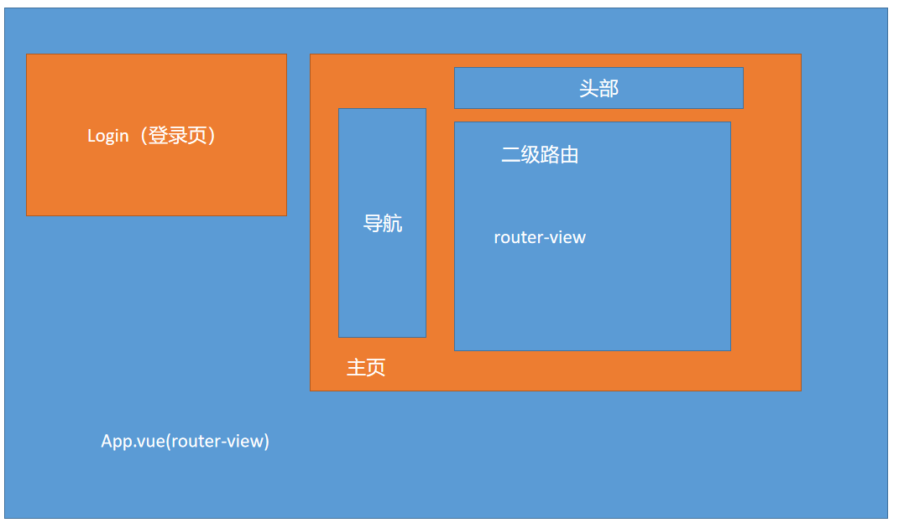

## 黑马头条PC-初始化项目-页面分析-新建登录和主页

- **`目标-任务`** 对具体的页面模块路由进行分析,并在路由中加入新建登录页面 +
- 
- 我们访问第一次会进入登录页面  得出 **`登录页`**是**`整个项目的入口页面`**, 登录页肯定属于一级路由
- 进入主页后 我们发现 页面出现了**`三个区域`**  其中中间区域的内容切换菜单时 会发生变化,所以判断 主页存在**`二级路由`**

**`结论`**:通过以上得出结论,  **`登录页`** 和 **`主页`**都为一级路由,主页下 存在**`二级路由`**

根据一级路由和二级路由关系设计以下路由表

| path           | 功能     | 备注           |
| -------------- | -------- | -------------- |
| /login         | 登录     | **`一级路由`** |
| /home          | 首页     | **`一级路由`** |
| /home/publish  | 发布文章 | 二级路由       |
| /home/articles | 文章列表 | 二级路由       |
| /home/comment  | 评论     | 二级路由       |
| /home/material | 素材     | 二级路由       |
| //home/fans    | 粉丝     | 二级路由       |
| /home/account  | 个人设置 | 二级路由       |

-  新建一个login组件和home组件,并配置路由表,在页面显示,提交git
- import login from './login ' //简写模式
- import login from './login/index.vue ' // 完整模式

## 黑马头条PC-登录模块-页面布局及样式

- **`目标-任务`**完成登录页的布局及开发
- **`注意`**千人千面,每个前端程序员对于样式的实现方式都不一样,手法和手段各有不同,但是目标都是写出精美的页面. 
  - 既然我们选择使用elementUI框架,那么任何样式布局的东西都可以先在element中寻找是否有适合的
- 登录实际是个表单 我们可以在ElementUI提供的表单类组件中寻找可使用的组件
- 表单 => 提交数据 ,校验数据 => elementUI表单

**`补充知识点`** 

在单文件组件中,如果需要在style标签中使用 诸如 **less** **scss**  需要在style标签上 给lang属性赋值 如图


**`scoped属性`**

默认情况下，vue单文件组件的style样式是[全局的]()，

如果在一个应用中使用了**多个**单文件组件，它们使用<span style="background-color:yellow;">相同选择器</span>为相同的元素设置了style样式，那么只有一个会起作用(**后者会覆盖前者**), 样式会冲突

**解决方法**：

如果加了**`scoped`**属性,那么当前组件的样式 **`只对当前自己的html`**起作用

给每个style标签都设置一个`scoped`属性，这样各个单文件组件的html标签解析出来后都会带有一个与其他单组件标签不同的`data-v-xxx`的唯一属性，style样式设定也会自动与本身组件的`data-v-xxx`联系起来，这样就使得style样式只针对自己的组件起作用了

> 开始实施 登录页的布局

登录页实际采用组件

表单 => 采集数据 ,校验数据

* **`el-form`**是表单的容器 ,如果要放置表单, 需要放置在**`el-form`**里面
* 如果 要放置一个input组件到表单 =>  需要放置在**`el-form-item`**里面

- [el-card](https://element.eleme.cn/#/zh-CN/component/card)
- [el-form](https://element.eleme.cn/#/zh-CN/component/form)
- [el-form-item](https://element.eleme.cn/#/zh-CN/component/form)
- el-button
- el-input
- el-checkbox
- 页面内容

```xml
<div class="login">
    <!-- 放置一个el-card组件 -->
    <el-card class='login-card'>
      <!-- 放置标题图片 -->
      <div class='title'>
        
      </div>
      <!-- 放置表单 -->
      <el-form>
        <!-- 表单域 里面   放置 input/select/checkbox 相当于一行-->
        <el-form-item>
           <el-input placeholder="请输入手机号"></el-input>
        </el-form-item>
        <!-- 表单域 -->
        <el-form-item>
          <el-input style="width:65%" placeholder="验证码"></el-input>
            <el-button style="float:right" plain>发送验证码</el-button>
        </el-form-item>
        <el-form-item>
          <!-- 复选框 -->
          <el-checkbox>我已阅读并同意用户协议和隐私条款</el-checkbox>
        </el-form-item>
        <el-form-item>
          <el-button type="primary" style="width:100%">登录</el-button>
        </el-form-item>
      </el-form>
    </el-card>
  </div>
```

页面样式

```less
.login  {
    background-image: url('../../assets/img/back.jpg');
    height: 100vh;
    background-size: cover;
    display: flex;
    justify-content: center;
    align-items: center;
    .login-card {
      width: 440px;
      height: 350px;
      .title {
        text-align: center;
        margin-bottom: 30px;
        img {
          height: 45px;
        }
      }
    }
  }
```

最终实现效果


## 黑马头条PC-登录模块-数据绑定及校验

**`目标-任务`**完成登录模块的表单数据绑定及数据校验-实现点击登录对手机号和验证码的验证

* 表单校验-两种-**`自动校验`**(校验单个表单数据)-**`手动校验`**-提交整个表单时,校验整个表单数据
* 数据校验 => el-form组件绑定 **`model`**属性 => 数据对象  给el-form绑定**`rules`**规则  给form-item配置**`prop`**,prop是校验的字段名(只写字段名)

### 表单校验准备

> 应该先在data中定义表单数据对象, 绑定到el-form的model属性上

```js
  data () {
    return {
      // 登录表单的数据
      loginForm: {
        mobile: '', // 手机号
        code: '', // 验证码
        checked: false // 是否同意用户协议
      }
    }
  }
```

* 通过采用elementUI的组件进行页面的渲染 绑定数据同样需要根据elementUI要求
* Form 组件提供了表单验证的功能，只需要通过 `rules` 属性传入约定的验证规则，并将 Form-Item 的 `prop` 属性设置为需校验的字段名即可。校验规则参见 [async-validator](https://github.com/yiminghe/async-validator)

> 需要在data中定义loginRules变量,绑定到el-form的rules属性上

```js
  data () {
    return {
      // 登录表单的数据
      loginForm: {
        mobile: '', // 手机号
        code: '', // 验证码
        checked: false // 是否同意用户协议
      },
      // 定义表单的验证规则
      loginRules: {

      }
    }
  }
```

> 将form-item中的 prop属性设置为要校验的字段名

```vue
     <el-form-item prop="mobile">
           <!-- 表单域  prop表示要绑定的字段名 -->
           <el-input placeholder="请输入手机号"></el-input>
     </el-form-item>
```

> 需要将表单中组件 双向绑定 **`v-model`** 我们的表单数据

```vue
 <el-form-item prop="mobile">
     <!-- 表单域  v-model双向绑定 -->
     <el-input v-model="loginForm.mobile" placeholder="请输入手机号"></el-input>
 </el-form-item>
```

* **el-form** 中的 **`model`**属性绑定表单数据对象
* **el-form** 中的 **`rules`**属性绑定数据的校验规则
* **el-form-item** 中的**`prop`**属性 写上 下面表单组件的字段名

* 数据的**`双向绑定`** => v-model 

### 表单规则编写-自动校验规则

> rules要求的数据格式

```json
{
    rules: {
        "字段名": [ 规则1, 规则2 ...  ]
    }
}
```

> 如果一个字段 有多个规则, 那么会从第一个开始校验, 如果没有通过, 则校验结束, 如果通过了则进行下一个规则的校验

我们应该定义三个字段的校验规则,代码如下

```json
      loginRules: {
        mobile: [], // 手机号的验证规则
        code: [], // 验证码的规则
        checked: [] // 是否勾选的规则
      }
```

> 首先 我们先对 字段进行必填项的校验,检查是否为  null / "" / undefined, 要用到规则中的**`required`**,
>
> **`message`** 表示不满足规则时的提示信息

```js
      loginRules: {
        mobile: [{ required: true, message: '您的手机号不能为空' }],
        code: [{ required: true, message: '您的验证码不能为空' }],
        checked: []
      }
```


**`注意`**: required只校验 null  '' undefined 和空字符串 ,但是不校验 false/true

> 验证完必填之后,我们可以借助 **`pattern`**选项来帮我们 正则验证内容是否符合格式
>
> 你需要给 pattern一个正则表达式,如果通过了就ok,如果不通过 就提示信息

手机号正则表达式   **`/^1[3-9]\d{9}$/`**

6位验证码的表达式  **`/^\d{6}$/`**

```js
 loginRules: {
        // required 如果为true表示该字段必填
        mobile: [{ required: true, message: '您的手机号不能为空' }, {
          pattern: /^1[3-9]\d{9}$/, // 正则表达式
          message: '您的手机号格式不正确'
        }],
        code: [{ required: true, message: '您的验证码不能为空' }, {
          pattern: /^\d{6}$/, // 要求6个数字
          message: '验证码应该是6位数字'
        }],
```

> 还有一个 checked没有校验, 如果你的业务过于复杂或者 现在场景不满足校验,我们可以采用 **`自定义校验`**的模式, **`validator`**

语法:  { **`validator`**: function (**`rule, value, callback`** ) {}  }

>如果 校验成功, 你需要直接执行最后一个方法 **`callback()`**, 如果执行失败 你也需要执行最后一个函数,但是 
>
>你需要在函数中抛出一个错误  **`callback(new Error('错误信息'))`**

```js
        checked: [{
          validator: function (rule, value, callback) {
          // rule是当前的校验规则
          // value是当前的要校验的字段的值
          // calllback是一个回调函数 不论成功或者失败都要执行
          // 成功执行callback 失败执行 callback(new Error('错误信息'))
          // 我们认为 如果 value 为true 就表示 校验成功 如果value 为false就表示校验失败
            // new Error(错误信息) 就是我们提示的错误信息
            value ? callback() : callback(new Error('您必须同意我们的霸王条款'))
          }
        }]
```


| 规则            | 说明                                                         |
| --------------- | ------------------------------------------------------------ |
| type(可不填)    | 指定要检验的字段的类型                                       |
| **`required`**  | 必填项,如果不填 就无法通过校验/如果为true,就表示该字段必填   |
| **`validator`** | **`自定义校验函数`**                                         |
| **`message`**   | 当不满足设置的规则时的提示信息                               |
| **`pattern`**   | 正则表达式                                                   |
| range           | 使用min和max属性定义范围。对于字符串和数组类型，将根据长度进行比较，对于数字类型，数字不得小于min，也不得大于max。 |
| len             | 要验证字段的确切长度，请指定len属性。对于字符串和数组类型，对length属性执行比较，对于数字类型，此属性指示数字的完全匹配，即，它可能仅严格等于len。如果len属性与最小和最大范围属性组合，则len优先。 |
| enum            | 要从可能值列表中验证值，请使用带枚举属性的枚举类型，列出该字段的有效值，例如： var descriptor = {   role: {type: "enum", enum: ['admin', 'user', 'guest']} } |

如果数据校验不满足 还可以自定义校验函数 **`validator`**

**`validator`**是一个函数, 其中有三个参数 (**`rule`**(当前规则),`value`(当前值),**`callback`**(回调函数))

```js
var  func = function (rule, value, callback) {
    // 根据value进行进行校验 
    // 如果一切ok  
    // 直接执行callback
    callback() // 一切ok 请继续
    // 如果不ok 
    callback(new Error("错误信息"))
}
```

### 表单手动校验

> 首先给按钮注册一个事件,绑定一个方法

* ref 可以获取 原生dom对象
* ref还可以获取组件对象实例, 将ref属性作用在 组件标签上,就可以用this.$refs.属性 获取组件对象的实例

> el-form 的组件实例里面有方法 可以去**`手动校验`**整个表单,

首先需要给 el-form一个ref属性 

```vue
   <el-form ref="loginForm" :model="loginForm" :rules="loginRules" style="margin-top:20px">

```

在点击事件中 调用 el-form对象的 validate方法

```js
    login () {
      //    this.$refs.loginForm 获取的就是el-form的对象实例
      this.$refs.loginForm.validate() // 方法
    }
```

>如何判断校验成功

```js
    login () {
      //    this.$refs.loginForm 获取的就是el-form的对象实例
      // 第一种 回调函数 isOK, fields(没有校验通过的字段)
      // this.$refs.loginForm.validate(function (isOK) {
      //   if (isOK) {
      //     console.log('校验通过')
      //   } else {
      //     console.log('校验未通过')
      //   }
      // }) // 方法
      // 第二种方式 promise
      this.$refs.loginForm.validate().then(() => {
        // 如果成功通过 校验就会到达 then

      })
    }
```


最终模板代码

```xml
<div class='login'>
    <!-- 表单 -->
    <el-card class='login-card'>
      <!-- 表单内容 -->
      <!-- 头部logo部分 -->
       <div class='title'>
         
       </div>
       <!-- 表单 绑定model属性  绑定rules属性(表单验证规则) ref 给el-form一个属性-->
       <el-form ref="loginForm" :model="loginForm" :rules="loginRules" style="margin-top:20px">
         <!-- 表单容器 设置prop属性 prop表示要校验的字段名-->
         <el-form-item prop="mobile">
           <!-- 表单域  v-model双向绑定 -->
           <el-input v-model="loginForm.mobile" placeholder="请输入手机号"></el-input>
         </el-form-item>
         <!-- 验证码 -->
         <el-form-item prop="code">
           <el-input v-model="loginForm.code" style="width:60%" placeholder="请输入验证码"></el-input>
           <!-- 放置一个按钮 -->
           <el-button style="float:right" plain>发送验证码</el-button>
         </el-form-item>
         <!-- 表单域 -->
         <el-form-item prop="checked">
           <!-- 是否同意被人家坑 -->
           <el-checkbox v-model="loginForm.checked">我已阅读同意用户协议和隐私条款</el-checkbox>
         </el-form-item>
         <!-- 按钮 -->
         <el-form-item>
           <el-button @click="login" style="width:100%" type="primary">登录</el-button>
         </el-form-item>
       </el-form>
    </el-card>
  </div>
```

最终js代码

```js
export default {
  data () {
    return {
      // 登录表单的数据
      loginForm: {
        mobile: '', // 手机号
        code: '', // 验证码
        checked: false // 是否同意用户协议
      },
      // 定义表单的验证规则
      loginRules: {
        // required 如果为true表示该字段必填
        mobile: [{ required: true, message: '您的手机号不能为空' }, {
          pattern: /^1[3-9]\d{9}$/, // 正则表达式
          message: '您的手机号格式不正确'
        }],
        code: [{ required: true, message: '您的验证码不能为空' }, {
          pattern: /^\d{6}$/, // 要求6个数字
          message: '验证码应该是6位数字'
        }],
        // 自定义校验  required不能校验true/false
        checked: [{
          validator: function (rule, value, callback) {
          // rule是当前的校验规则
          // value是当前的要校验的字段的值
          // calllback是一个回调函数 不论成功或者失败都要执行
          // 成功执行callback 失败执行 callback(new Error('错误信息'))
          // 我们认为 如果 value 为true 就表示 校验成功 如果value 为false就表示校验失败
            // new Error(错误信息) 就是我们提示的错误信息
            value ? callback() : callback(new Error('您必须同意我们的霸王条款'))
          }
        }]
      }
    }
  },
  methods: {
    login () {
      //    this.$refs.loginForm 获取的就是el-form的对象实例
      // 第一种 回调函数 isOK, fields(没有校验通过的字段)
      // this.$refs.loginForm.validate(function (isOK) {
      //   if (isOK) {
      //     console.log('校验通过')
      //   } else {
      //     console.log('校验未通过')
      //   }
      // }) // 方法
      // 第二种方式 promise
      this.$refs.loginForm.validate().then(() => {
        // 如果成功通过 校验就会到达 then

      })
    }
  }
}
```

结论: 用到的**正则表达式**

手机号: **/^1[3-9]\d{9}$/**

6位数字:**/^\d{6}$/**

* el-form  需要绑定model,需要规则rules 
* el-form-item 需要prop属性 需要绑定校验的字段 
* rules规则 => required必填 pattern正则表达式 message 提示信息 
* 自定义校验函数 validator  => rule,value,callback =>  callBack() / callBack(new Error(错误信息))

## 黑马头条PC-登录模块-安装axios-配置全局使用

**`目标-任务`** 将axios安装在当前项目中,并将其赋值给全局对象,在任何位置都可以访问 并配置baseUrl

* 登录需要接口访问,访问工具推荐 axios

* axios 安装到运行依赖

  ```bash 
  $ npm i axios -S
  or 
  $ npm install axios --save
  ```

* 引入axios 配置baseUrl

```js
import axios from 'axios' // 引入axios
// 配置axios的baseURL
axios.defaults.baseURL = 'http://ttapi.research.itcast.cn/mp/v1_0' // 配置公共的请求头地址
Vue.prototype.$axios = axios // 将axios赋值给 Vue对象的原型属性
```

* 在main.js中引用 并赋值给Vue的原型属性

  

## 黑马头条PC-登录模块-登录请求-返回值中token解析

**`目标-任务`** 通过axios调用登录接口,得到登录返回值 分析返回值意义

```js
     this.$axios({
          url: '', // 请求地址
          params: {}, // 指的是url参数 参数会拼接到 url地址上面  常常说的 get参数
          data: {}, // body请求体参数 常用于 post /put /patch
          method: '' // 请求类型 post/get/delete/put/patch 默认值是get类型 可全大写 可全小写
        })
```

> 调用登录接口,获取返回结果

```js
      this.$refs.loginForm.validate().then(() => {
        // 如果成功通过 校验就会到达 then
        // 通过校验之后 应该做什么事 -> 应该调用登录接口 看看手机号是否正常
        //   this.$axios.get/post/delete/put
        this.$axios({
          url: '/authorizations', // 请求地址
          data: this.loginForm,
          // data: { ...this.loginForm, checked: null }, // body请求体参数
          method: 'post'
        }).then(result => {
          // 成功 之后打印结果
          console.log(result.data)
        }).catch(() => {

        })
      })
```

**得到的数据结果**:

<table>
  <thead class="ant-table-thead">
    <tr>
      <th key=name>名称</th><th key=type>类型</th><th key=required>是否必须</th><th key=default>默认值</th><th key=desc>备注</th><th key=sub>其他信息</th>
    </tr>
  </thead><tbody className="ant-table-tbody"><tr key=0-0><td key=0><span style="padding-left: 0px"><span style="color: #8c8a8a"></span> message</span></td><td key=1><span>string</span></td><td key=2>必须</td><td key=3></td><td key=4><span>消息提示</span></td><td key=5></td></tr><tr key=0-1><td key=0><span style="padding-left: 0px"><span style="color: #8c8a8a"></span> data</span></td><td key=1><span>object</span></td><td key=2>非必须</td><td key=3></td><td key=4><span>数据</span></td><td key=5></td></tr><tr key=0-1-0><td key=0><span style="padding-left: 20px"><span style="color: #8c8a8a">├─</span> token</span></td><td key=1><span>string</span></td><td key=2>必须</td><td key=3></td><td key=4><span>用户token令牌</span></td><td key=5></td></tr><tr key=0-1-1><td key=0><span style="padding-left: 20px"><span style="color: #8c8a8a">├─</span> refresh_token</span></td><td key=1><span>string</span></td><td key=2>必须</td><td key=3></td><td key=4><span>用于刷新token的令牌</span></td><td key=5></td></tr><tr key=0-1-2><td key=0><span style="padding-left: 20px"><span style="color: #8c8a8a">├─</span> id</span></td><td key=1><span>integer</span></td><td key=2>必须</td><td key=3></td><td key=4><span>用户id</span></td><td key=5></td></tr><tr key=0-1-3><td key=0><span style="padding-left: 20px"><span style="color: #8c8a8a">├─</span> name</span></td><td key=1><span>string</span></td><td key=2>必须</td><td key=3></td><td key=4><span>用户昵称</span></td><td key=5></td></tr><tr key=0-1-4><td key=0><span style="padding-left: 20px"><span style="color: #8c8a8a">├─</span> photo</span></td><td key=1><span>string</span></td><td key=2>必须</td><td key=3></td><td key=4><span>用户头像</span></td><td key=5></td></tr>
               </tbody>
              </table>

我们需要重点分析一下上面传给我们的**`token(令牌)`**

* **token令牌** 是**`前后分离`**时代的产物
* 传统模式 采用的是**session**和**cookie** 
* 


## 黑马头条PC-登录模块-登录请求-token存储问题

**`目标-任务`**对token令牌进行前端存储,以便后续接口访问使用

* 上个小节中我们发现 token会被频繁用到,不可能每次请求接口之前先去后端登录获取一下token,所以token要在前端进行持久化

**`前端持久化`** 可以直接采用 **`localStorage`** localStorage和session没关系

实际代码

```js
      this.$refs.loginForm.validate().then(() => {
        // 如果成功通过 校验就会到达 then
        // 通过校验之后 应该做什么事 -> 应该调用登录接口 看看手机号是否正常
        //   this.$axios.get/post/delete/put
        this.$axios({
          url: '/authorizations', // 请求地址
          data: this.loginForm,
          // data: { ...this.loginForm, checked: null }, // body请求体参数
          method: 'post'
        }).then(result => {
          // 成功 之后打印结果
          // 把钥匙放在兜里 也就是把token存于 本地缓存
          window.localStorage.setItem('user-token', result.data.data.token)
        }).catch(() => {

        })
      })
```

## 黑马头条PC-登录模块-登录成功及失败处理

**`目标-任务`** 对登录成功或者失败时进行不同的处理

* 登录成功时 需要跳转 到主页
* 登录失败时 提示信息

实际代码

```js
          this.$axios({
            url: '/authorizations',
            method: 'post',
            data: this.loginForm
          }).then(result => {
            // console.log(result.data.data.token)
            // 放到前端的缓存中
            window.localStorage.setItem('user-token', result.data.data.token)
            // 编程式导航
            this.$router.push('/') // 登录成功 跳转到home页
          }).catch(() => {
            this.$message({
              message: '手机号或者验证码错误',
              type: 'warning'
            })
          })

```

