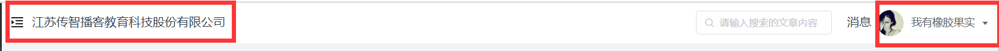
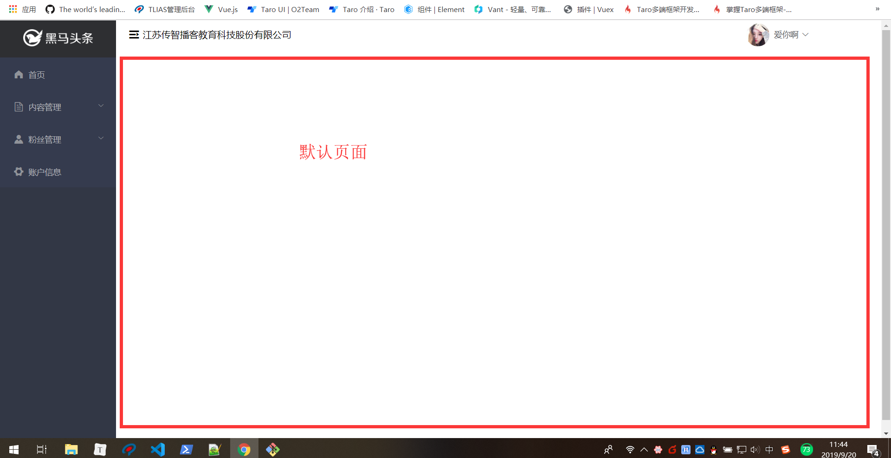

## 黑马头条PC-主页模块-页面布局

**`思路-步骤`** 实现以下布局


* elementUI组件 是否有支持类似效果的

* el-container => 大容器

* 左侧 =>  el-aside 

* 右侧 => el-container =>  el-header- el-main

* ```xml
  <!-- 先定义一个大容器 -->
    <el-container>
      <!-- 先放置一个左侧 -->
      <el-aside>左侧内容</el-aside>
      <!-- 右侧大容器 -->
      <el-container>
        <!-- 头部 -->
        <el-header>头部</el-header>
        <!-- 中部区域 -->
        <el-main>
          <!-- 二级路由容器 -->
           <router-view></router-view>
        </el-main>
      </el-container>
    </el-container>
  ```

  

## 黑马头条PC-主页模块-左侧导航菜单

**`思路-步骤`**

- 左侧菜单背景色 #323745
- 菜单上部图片背景色  #2e2f32
- 导航背景色 #353b4e
- 导航字体颜色 #adafb5
- 导航字体激活颜色  #ffd04b

* ```xml
  <div class='layout-aside'>
       <div class='title'>
           
       </div>
       <el-menu
        style="width:201px"
        background-color="#353b4e"
        text-color="#adafb5"
        active-text-color="#ffd04b">
        <!-- 首页 -->
         <el-menu-item index="4">
             <!-- 图标 -->
          <i class="el-icon-s-home"></i>
          <span slot="title">首页</span>
        </el-menu-item>
        <!-- 内容管理 二级菜单 el-submenu => el-menu-item-->
        <el-submenu index="1">
            <!-- el-submenu 插槽 title =>  一级显示内容 -->
          <template slot="title">
            <i class="el-icon-document"></i>
            <span>内容管理</span>
          </template>
            <!-- 二级内容 -->
            <el-menu-item index="1-1">发布文章</el-menu-item>
            <el-menu-item index="1-2">内容列表</el-menu-item>
            <el-menu-item index="1-3">评论列表</el-menu-item>
            <el-menu-item index="1-3">素材管理</el-menu-item>
        </el-submenu>
        <el-submenu>
            <!-- title插槽时submenu 中显示的一级内容 -->
            <template slot='title'>
                <i class='el-icon-s-custom'></i>
                <span>粉丝管理</span>
            </template>
            <!-- 二级内容 -->
           <el-menu-item>图文数据</el-menu-item>
           <el-menu-item>粉丝概况</el-menu-item>
           <el-menu-item>粉丝画像</el-menu-item>
           <el-menu-item>粉丝列表</el-menu-item>
  
        </el-submenu>
        <el-menu-item index="3" >
          <i class="el-icon-s-tools"></i>
          <span slot="title">账户信息</span>
        </el-menu-item>
  
      </el-menu>
    </div>
  ```

## 黑马头条PC-主页模块-头部结构及下拉菜单

**`思路-步骤`**



elementUI => flex =>el-row/ el-col

```html
 <el-row class='layout-header' type='flex' align="middle">
      <!-- 先定义一行 -->
     <el-col class='left' :span="12">
         <i class='el-icon-s-fold'></i>
         <span>江苏传智播客教育科技股份有限公司</span>
     </el-col>
     <el-col class='right' :span="12">
         <el-row type='flex' justify="end" align="middle">
             
             <!-- 下拉菜单 -->
             <el-dropdown>
                 <!-- 匿名插槽  下拉菜单显示的元素内容 -->
                 <span>水若寒宇</span>
                 <el-dropdown-menu slot="dropdown">
                     <el-dropdown-item>个人信息</el-dropdown-item>
                     <el-dropdown-item>git地址</el-dropdown-item>
                     <el-dropdown-item>退出</el-dropdown-item>
                 </el-dropdown-menu>
             </el-dropdown>
         </el-row>
     </el-col>

  </el-row>
```


## 黑马头条PC-统一全局注册插件的使用方式Vue.use

**`思路-步骤`**实现 像elementUI一样 ,直接use ,然后就随便用

* elementUI里面 导出了一个对象=> Vue.use就会调用对象中的方法 =>install(Vue)

* ```js
  export default { 
    install(Vue){
        Vue.component()
        Vue.component()
        Vue.component()
        Vue.component()
        Vue.component()
        Vue.proptotype.$message = ''
    }
  }
  // elementUI导出的方法
  ```

* Vue.use(对象) => Vue框架 会调用 对象中的方法 **`install方法`**

* 调用insall方法时, 会传入Vue对象

* elementUI的install方法 里面 拿到了Vue对象, **`Vue.component()`** // 注册 组件

* 要实现类似elementUI的效果 => 定义对象  => install方法 =>  全局注册组件

* ```js
  import layoutAside from './home/layout-aside'
  import layoutHeader from './home/layout-header'
  
  // 所有自定义组件的插件
  export default {
    install: function (Vue) {
      Vue.component('layout-aside', layoutAside) // 注册 左侧导航组件
      Vue.component('layout-header', layoutHeader) // 注册头部组件
    }
  }
  
  ```

  

## 黑马头条PC-主页模块-头部信息查询

**`思路-步骤`**


* 调用接口 =>查询 用户信息  => 用户信息 展示到 页面上
* img => 固定地址的话  =>  代码编译时 ,会将 img 的图片 编译成base64字符串 => 可以预览
* img => 动态变量  => 给一个相对地址 不能够让图片显示
* 如果想显示 => 需要先将图片变化成变量 => 动态展示

* 图片 地址 => 动态变量时  => require(地址) => 变量 => 去做逻辑判断

## 黑马头条PC-主页模块-头部退出系统

**`思路-步骤`**

* 退出 => 登录页, 删除掉令牌

* ```js
      //   点击菜单项时触发
      clickMenu (command) {
        if (command === 'info') {
  
        } else if (command === 'git') {
          //   跳转到git地址
          window.location.href = 'https://github.com/shuiruohanyu/90heimatoutiao'
        } else {
          //    退出
          window.localStorage.removeItem('user-token') // 删除令牌
          this.$router.push('/login') // 回到登录页
        }
      }
  ```

  


## 黑马头条PC-主页模块-左侧导航配置路由

**`思路-步骤`**

* el-menu  => 左侧导航 => 导航路由? 

* router-link => to => 跳转地址

* el-menu => router => true  => 使用 vue-router 的模式，启用该模式会在激活导航时以 index 作为 path 进行路由跳转

* :router="true" => 设置router 为true的完整写法

* router  =>  等价于 :router="true"

* | path           | 功能     | 备注           |
  | -------------- | -------- | -------------- |
  | /login         | 登录     | **`一级路由`** |
  | /home          | 首页     | **`一级路由`** |
  | /home/publish  | 发布文章 | 二级路由       |
  | /home/articles | 文章列表 | 二级路由       |
  | /home/comment  | 评论     | 二级路由       |
  | /home/material | 素材     | 二级路由       |
  | //home/fans    | 粉丝     | 二级路由       |
  | /home/account  | 个人设置 | 二级路由       |

## 黑马头条PC-主页模块-默认导航

**`思路-步骤`**



* 二级路由的path  什么都不写 代表 二级路由的默认组件

## 黑马头条PC-登录模块-主页-权限思考

**`思路-步骤`**  

* 不论登录与否 =>都可以直接进入主页 => **`不对`**!!!!

* 如果没登录 => 不能进入主页 =>  没token就不能进入主页

* 进入主页 => 有token => 放行

* 拦截 => 路由改变瞬间 => 判断有无token => 有token  继续 =>没token 就回登录

* 路由改变瞬间 => 导航守卫 => 路由改变时  => 页面拦截

  

## 黑马头条PC-主页模块-导航守卫

**`思路-步骤`**

* router.beforeEach  => 全局前置守卫 => 在每一个路由发生改变之前 会触发这个事件

  ```js
  router.beforeEach(function(to,from,next){})
  ```

  login => home

  this.$route.path

  **to: Route**: 即将要进入的目标 [路由对象](https://router.vuejs.org/zh/api/#路由对象)

  **from: Route**: 当前导航正要离开的路由

  **next: Function**: 一定要调用该方法来 **resolve** 这个钩子。执行效果依赖 `next` 方法的调用参数。

  ```js
  new Promise(function(resolve,reject){   }).then
  ```

  * next函数必须执行 =>不执行 就会死在跳转的位置
  * 如果直接执行next() => 表示一切正常 login => home 可以正常走   类似 callback()
  * **next(false)** => 中断当前的导航 =>  login => home 不能正常走  停在login
  * **next(地址)** => 强制将login=>home =>另一个地址 

  ```js
  import router from './router'
  // 全局前置守卫
  router.beforeEach(function (to, from, next) {
    // 判断 拦截的范围
    if (to.path.startsWith('/home')) {
      // 进入到了拦截范围
      // 判断是否登录 有token 就登录 没token就没登录
      let token = window.localStorage.getItem('user-token') // 获取token
      if (token) {
        // 如果有token
        next()
      } else {
        next('/login') // 没有token 就跳转到登录页
      }
    } else {
      next() // 放行
    }
  })
  // 先导出
  export default router
  ```

  

## 黑马头条PC-接口访问-token统一处理思考

**`思路-步骤`**

* token是令牌, 调用接口时 基本都要携带令牌,携带令牌的方式 各个接口 自己找自己的,这种方式不统一!!! 不好!!!!

班里有50个同学,要去食堂吃饭,但是吃饭每个人需要**`证件(token)`**,现在教室里每个人的证件都在讲台上,大家去吃饭先要去讲台上**`拿证件(取token)`**才能吃饭,50个人要分别上50次讲台,**`每个人独自取自己的token`**,现在有个方案,在大家出门前,老师自动把**`证件(统一注入token)`**放到每个人的兜里,大家不再需要上讲台拿证件,直接去食堂,很爽!!!!!

* 统一处理携带的令牌 => token => 携带参数  => axios =>headers=>Authorization
* axios拦截器 
* 请求拦截

## 黑马头条PC-接口访问-axios拦截器-统一处理请求token

**`思路-步骤`**

* 请求拦截 => **`请求之前`**拦截 =>  **`请求到达后台之前`**拦截
* **`请求到达后台之前`** => 将token塞进去,token格式一致
* 

* 响应拦截 => 别人返回的数据 拦截

```js
// 负责对axios进行处理
import axios from 'axios'
axios.interceptors.request.use(function (config) {
  // 在发起请求请做一些业务处理
  // config是要发送请求的配置信息
  let token = window.localStorage.getItem('user-token') // 获取token
  config.headers['Authorization'] = `Bearer ${token}` // 统一注入token 到headers属性 因为所有接口要求的token格式是一样的
  return config
}, function (error) {
  // 对请求失败做处理
  return Promise.reject(error)
})
export default axios
```

* config 的选项对象  axios默认选项

  ```json
  {
     // `url` 是用于请求的服务器 URL
    url: '/user',
  
    // `method` 是创建请求时使用的方法
    method: 'get', // default
  
    // `baseURL` 将自动加在 `url` 前面，除非 `url` 是一个绝对 URL。
    // 它可以通过设置一个 `baseURL` 便于为 axios 实例的方法传递相对 URL
    baseURL: 'https://some-domain.com/api/',
  
    // `transformRequest` 允许在向服务器发送前，修改请求数据
    // 只能用在 'PUT', 'POST' 和 'PATCH' 这几个请求方法
    // 后面数组中的函数必须返回一个字符串，或 ArrayBuffer，或 Stream
    transformRequest: [function (data, headers) {
      // 对 data 进行任意转换处理
      return data;
    }],
  
    // `transformResponse` 在传递给 then/catch 前，允许修改响应数据
    transformResponse: [function (data) {
      // 对 data 进行任意转换处理
      return data;
    }],
  
    // `headers` 是即将被发送的自定义请求头
    headers: {'X-Requested-With': 'XMLHttpRequest'},
  
    // `params` 是即将与请求一起发送的 URL 参数
    // 必须是一个无格式对象(plain object)或 URLSearchParams 对象
    params: {
      ID: 12345
    },
  
     // `paramsSerializer` 是一个负责 `params` 序列化的函数
    // (e.g. https://www.npmjs.com/package/qs, http://api.jquery.com/jquery.param/)
    paramsSerializer: function(params) {
      return Qs.stringify(params, {arrayFormat: 'brackets'})
    },
  
    // `data` 是作为请求主体被发送的数据
    // 只适用于这些请求方法 'PUT', 'POST', 和 'PATCH'
    // 在没有设置 `transformRequest` 时，必须是以下类型之一：
    // - string, plain object, ArrayBuffer, ArrayBufferView, URLSearchParams
    // - 浏览器专属：FormData, File, Blob
    // - Node 专属： Stream
    data: {
      firstName: 'Fred'
    },
  
    // `timeout` 指定请求超时的毫秒数(0 表示无超时时间)
    // 如果请求话费了超过 `timeout` 的时间，请求将被中断
    timeout: 1000,
  
     // `withCredentials` 表示跨域请求时是否需要使用凭证
    withCredentials: false, // default
  
    // `adapter` 允许自定义处理请求，以使测试更轻松
    // 返回一个 promise 并应用一个有效的响应 (查阅 [response docs](#response-api)).
    adapter: function (config) {
      /* ... */
    },
  
   // `auth` 表示应该使用 HTTP 基础验证，并提供凭据
    // 这将设置一个 `Authorization` 头，覆写掉现有的任意使用 `headers` 设置的自定义 `Authorization`头
    auth: {
      username: 'janedoe',
      password: 's00pers3cret'
    },
  
     // `responseType` 表示服务器响应的数据类型，可以是 'arraybuffer', 'blob', 'document', 'json', 'text', 'stream'
    responseType: 'json', // default
  
    // `responseEncoding` indicates encoding to use for decoding responses
    // Note: Ignored for `responseType` of 'stream' or client-side requests
    responseEncoding: 'utf8', // default
  
     // `xsrfCookieName` 是用作 xsrf token 的值的cookie的名称
    xsrfCookieName: 'XSRF-TOKEN', // default
  
    // `xsrfHeaderName` is the name of the http header that carries the xsrf token value
    xsrfHeaderName: 'X-XSRF-TOKEN', // default
  
     // `onUploadProgress` 允许为上传处理进度事件
    onUploadProgress: function (progressEvent) {
      // Do whatever you want with the native progress event
    },
  
    // `onDownloadProgress` 允许为下载处理进度事件
    onDownloadProgress: function (progressEvent) {
      // 对原生进度事件的处理
    },
  
     // `maxContentLength` 定义允许的响应内容的最大尺寸
    maxContentLength: 2000,
  
    // `validateStatus` 定义对于给定的HTTP 响应状态码是 resolve 或 reject  promise 。如果 `validateStatus` 返回 `true` (或者设置为 `null` 或 `undefined`)，promise 将被 resolve; 否则，promise 将被 rejecte
    validateStatus: function (status) {
      return status >= 200 && status < 300; // default
    },
  
    // `maxRedirects` 定义在 node.js 中 follow 的最大重定向数目
    // 如果设置为0，将不会 follow 任何重定向
    maxRedirects: 5, // default
  
    // `socketPath` defines a UNIX Socket to be used in node.js.
    // e.g. '/var/run/docker.sock' to send requests to the docker daemon.
    // Only either `socketPath` or `proxy` can be specified.
    // If both are specified, `socketPath` is used.
    socketPath: null, // default
  
    // `httpAgent` 和 `httpsAgent` 分别在 node.js 中用于定义在执行 http 和 https 时使用的自定义代理。允许像这样配置选项：
    // `keepAlive` 默认没有启用
    httpAgent: new http.Agent({ keepAlive: true }),
    httpsAgent: new https.Agent({ keepAlive: true }),
  
    // 'proxy' 定义代理服务器的主机名称和端口
    // `auth` 表示 HTTP 基础验证应当用于连接代理，并提供凭据
    // 这将会设置一个 `Proxy-Authorization` 头，覆写掉已有的通过使用 `header` 设置的自定义 `Proxy-Authorization` 头。
    proxy: {
      host: '127.0.0.1',
      port: 9000,
      auth: {
        username: 'mikeymike',
        password: 'rapunz3l'
      }
    },
  
    // `cancelToken` 指定用于取消请求的 cancel token
    // （查看后面的 Cancellation 这节了解更多）
    cancelToken: new CancelToken(function (cancel) {
    })
  }
  ```

  

## 黑马头条PC--接口访问-axios拦截器-统一处理响应数据

**`思路-步骤`** 

* 响应拦截  =>数据响应回来   **`到达then之前(响应拦截)`**=> then

 在axios 请求的响应数据 **`then`**执行之前也可以拦截 响应拦截器

return response =>  response =>  then(result)

处理返回响应数据 => resutlt.data.data =>  result.data

```js
axios.interceptors.response.use(function (response) {
    // 对响应数据做处理
    return response;
  }, function (error) {
    // 对响应错误做处理
    return Promise.reject(error);
  });
```

```js
// 响应拦截 响应数据 回来 到达then方法之前
axios.interceptors.response.use(function (response) {
  // 对响应数据做处理 执行成功时进入
  return response.data ? response.data : {}
}, function () {
  // 执行失败时执行
})
```


## 黑马头条PC--接口访问-axios拦截器-统一处理异常数据

**`思路-步骤`**

* 只有状态码 OK时 才会进入then=>状态码 200/201  否则 catch

* axios => then(成功),catch(失败)

* 统一处理失败 => 拦截器里统一处理失败 => 响应拦截器 => 响应拦截器中有状态码

* ```js
  // 响应拦截 响应数据 回来 到达then方法之前
  axios.interceptors.response.use(function (response) {
    // 对响应数据做处理 执行成功时进入
    return response.data ? response.data : {}
  }, function (error) {
    // 执行失败时执行
    let status = error.response.status // 获取失败的状态码
    let message = '未知错误'
    switch (status) {
      case 400:
        message = '请求参数错误'
        break
      case 403:
        message = '403 refresh_token未携带或已过期'
        break
      case 507:
        message = '服务器数据库异常'
        break
      case 401:
        message = 'token过期或未出'
        window.localStorage.clear() // 清空缓存
        router.push('/login') // this.$router.push()
        break
      case 404:
        message = '手机号不正确'
        break
      default:
        break
    }
    Message({ message })
    //   希望 在异常处理函数中将所有的错误都处理完毕 不再进入catch  终止错误
    return new Promise(function () {}) // 终止当前的错误
  })
  ```

  

