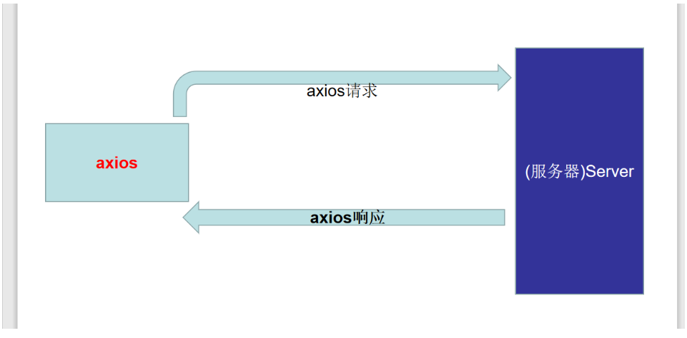

## 黑马头条PC-主页模块-页面布局

**`思路-步骤`** 实现以下布局


* elementUI组件 是否有支持类似效果的

* el-container => 大容器

* 左侧 =>  el-aside 

* 右侧 => el-container =>  el-header- el-main

* ```xml
  <!-- 先在最外层放置一个大容器 因为 小容器只能放到大容器里面 -->
     <el-container>
       <el-aside>
         <h1>左侧导航区域</h1>
       </el-aside>
       <!-- 右侧 再嵌套一个 el-container -->
       <el-container>
         <!-- 再上下布局 -->
         <el-header>
           <h1>顶部操作栏</h1>
         </el-header>
         <!-- 主要区域 -->
         <el-main>
           <h1>主要区域</h1>
            <!-- 这里应该放置 二级路由容器 -->
           <router-view></router-view>
       </el-main>
       </el-container>
     </el-container>
  ```
  
  

## 黑马头条PC-主页模块-左侧导航菜单

**`思路-步骤`**

左侧菜单背景色   **`#323745`** 菜单图片背景色  **`#2e2f32`**导航背景色 **`#353b4e`**导航字体颜色 **`#adafb5`**

> 首先确定 左侧导航菜单的技术方案,我们采用elementUI组件 **`el-menu`**

我们应该 单独封装一个左侧导航组件,然后在主页中使用, 接下来封装一个普通组件**`layout-aside`**

普通组件  一般放置在 components目录下

路由组件 一般放在  views(pages)目录下

> 在components 下的home文件夹里面 新建一个 layout-aside.vue, 在主页中引用,注册 并使用

接下来,就要实现左侧导航的结构

```vue
<template>
  <div class='layout-aside'>
     <!-- 头部图片 -->
     <div class='title'>
         
     </div>
     <!-- 导航菜单 -->
     <el-menu background-color="#323745" text-color="#adafb5">
         <!-- 子菜单 没有子菜单的 用 el-menu-item标签 -->
         <el-menu-item>
             <i class='el-icon-s-home'></i>
             <span>首页</span>
         </el-menu-item>
         <!-- 二级菜单 需要用submenu -->
         <el-submenu>
             <template slot="title">
                <i  class='el-icon-s-grid'></i>
                <span >内容管理</span>
             </template>
             <!-- 匿名插槽是二级菜单  具名插槽title是一级菜单-->
             <!-- 二级菜单项 还是使用el-menu-item -->
             <el-menu-item>发布文章</el-menu-item>
             <el-menu-item>内容列表</el-menu-item>
             <el-menu-item>评论列表</el-menu-item>
             <el-menu-item>素材管理</el-menu-item>

         </el-submenu>
           <el-submenu>
               <template slot="title">
                 <i class='el-icon-s-opportunity'></i>
                 <span>粉丝管理</span>
               </template>
             <!-- 二级菜单项 还是使用el-menu-item -->
             <el-menu-item>图文数据</el-menu-item>
             <el-menu-item>粉丝概况</el-menu-item>
             <el-menu-item>粉丝画像</el-menu-item>
             <el-menu-item>粉丝列表</el-menu-item>

         </el-submenu>
         <el-menu-item>
             <i class="el-icon-user-solid"></i>
             <span>账户信息</span>
         </el-menu-item>
     </el-menu>
  </div>
</template>

<script>
export default {

}
</script>

<style lang='less' scoped>
  .layout-aside {
      background-color: #2e2f32;
      width:230px;
      height: 100vh;
      .title {
          text-align: center;
          padding: 10px 0;
          img {
              height: 35px;
          }
      }
      .el-menu {
          border-right: none;
      }
  }
</style>

```

el-menu 导航菜单

el-menu-item 子菜单

el-submenu  折叠菜单

## 黑马头条PC-主页模块-头部结构及下拉菜单

**`思路-步骤`**

> 开发头部结构,顶部操作栏, 同样新建一个普通组件 layout-header组件, 同样在home文件下

在主页组件中 引入,注册 并且使用 layout-header组件

> 接下来 实现 顶部操作栏的页面结构

```vue
<template>
  <!-- elementUI布局组件 el-row 和 el-col -->
  <el-row align="middle" type='flex' class='layout-header'>
      <!-- 等分为两列  为什么是:span="12"-->
    <el-col class='left' :span="12">
       <!-- 图标 -->
       <i class='el-icon-s-fold'></i>
       <span>
           江苏传智播客教育科技股份有限公司
       </span>
    </el-col>
    <!-- 右侧列 -->
    <el-col class='right' :span="12">
        <!-- 再次放置一个 row组件  align属性设置垂直对齐方式  justify设置 水平对齐属性-->
        <el-row type='flex' justify="end" align="middle">
          
           <!-- 下拉菜单 -->
           <el-dropdown trigger='click'>
               <!-- 显示的内容 -->
               <span>水若寒宇</span>
                <!-- 下拉内容需要做具名插槽dropdown  el-dropdown-menu是专门做下拉的组件 -->
                <el-dropdown-menu slot="dropdown" >
                   <!-- 下拉选项 el-dropdown-item 作为下拉选项组件-->
                    <el-dropdown-item>个人信息</el-dropdown-item>
                    <el-dropdown-item>git地址</el-dropdown-item>
                    <el-dropdown-item>退出</el-dropdown-item>

                </el-dropdown-menu>
           </el-dropdown>
        </el-row>
    </el-col>
  </el-row>
</template>

<script>
export default {

}
</script>

<style lang='less' scoped>
  .layout-header {
      height: 60px;
      .left {
          i {
              font-size:20px;
          }
      }
      .right {
          img {
              width: 40px;
              height: 40px;
              border-radius: 50%;
              margin-right: 4px;
          }
      }
  }
</style>

```


## 黑马头条PC-统一全局注册插件的使用方式Vue.use

**`思路-步骤`**

> Vue.use 是全局注册的方式 会调用 对象中的一个**`install`**方法,并且传入 Vue对象作为参数

我们需要把目前的组件引入注册形式 改成 Vue.use 的形式

> 首先我们需要一个公共的注册的js文件, 这个文件负责 注册我们自己开发的所有的组件

在components文件夹下 新建一个**`index.js`**文件,作为公共的注册文件

> 这个文件要完成所有的组件的注册 , 全局注册

```js

// 需要使用Vue.use的方式去注册
// Vue.use会调用对象中的install方法 install方法第一个参数 是Vue对象
import LayoutHeader from './home/layout-header'
import LayoutAside from './home/layout-aside'

export default {
  install: function (Vue) {
    //   注册全局组件 Vue 一旦注册 在任意位置都可以使用
    Vue.component('layout-header', LayoutHeader) // 注册头部组件
    Vue.component('layout-aside', LayoutAside) // 注册左侧导航组件
  }
}
```

> 以上这种方式, 可以直接用Vue.use全局注册我们使用的组件,就不需要再一次次的引入 注册了

## 黑马头条PC-主页模块-头部信息查询

**`思路-步骤`**

> 我们需要 获取用户的个人信息 显示在头部信息栏区域

此时需要调用api接口

> 应该在 组件实例化之后就调用接口, 应该在**`created`** 获取用户的个人资料

应该在data中定义一个对象来接收数据

```js
  data () {
    return {
      userInfo: {} // 用户个人信息
    }
  },
```

> 在 钩子函数 created中 获取用户资料,注意需要 **`取钥匙`**, 将token放入到 headers中,

```js
  created () {
    const token = localStorage.getItem('user-token') // 从兜里拿钥匙 也就是从缓存中取token
    //   获取用户的个人信息
    this.$axios({
      url: '/user/profile', // 请求地址
      headers: {
        Authorization: `Bearer ${token}` // 格式要求 Bearer +token
      } // 请求头参数 headers放置请求头参数
    }).then(result => {
      // 如果加载成功了 我们要将数据赋值给 userInfo
      this.userInfo = result.data.data
    })
  }
```

> 将数据 使用 v-bind绑定给页面结构

## 黑马头条PC-主页模块-头部退出系统

**`思路-步骤`**

> 退出应该做什么 ? 

1. 删除token ,因为token是登录的标记
2. 跳转到登录页面

> 需要去注册点击事件, 点击下拉菜单的事件  command事件

点击了 下拉菜单的菜单项,会触发 command事件, 并传入 点击菜单项中的command参数

```js
clickMenu (command) {
      // 需要处理三种情况
      if (command === 'info') {
        // 点击了个人信息
      } else if (command === 'git') {
        // 如果点击了git地址就跳转到git仓库
        window.location.href = 'https://github.com/shuiruohanyu/94-heimatoutiaopc'
      } else {
        // 退出系统 1. 删除token 2. 跳转回登录页
        window.localStorage.removeItem('user-token') // 删除localstorage中某个选项
        this.$router.push('/login') // 跳回登录页  编程式导航
      }
    }
```

注意: 需要给每一个下拉菜单的选项一个**`command`**参数

```vue
  <el-dropdown-item command="info">个人信息</el-dropdown-item>
  <el-dropdown-item command="git">git地址</el-dropdown-item>
  <el-dropdown-item command="lgout">退出</el-dropdown-item>
```


## 黑马头条PC-主页模块-左侧导航配置路由

**`思路-步骤`**

> 实际上,左侧菜单是一个导航, 路由中 是使用router-link做的导航,现在我们用的是element-ui的 导航菜单组件,应该怎么办呢 ? 

对菜单开启路由模式:

```vue
<el-menu router background-color="#323745" text-color="#adafb5">
```

需要给每一个菜单项配置 **`index`**属性,index属性会在路由模式下 作为**`跳转路径`**

| path           | 功能     | 备注           |
| -------------- | -------- | -------------- |
| /login         | 登录     | **`一级路由`** |
| /home          | 首页     | **`一级路由`** |
| /home/publish  | 发布文章 | 二级路由       |
| /home/articles | 文章列表 | 二级路由       |
| /home/comment  | 评论     | 二级路由       |
| /home/material | 素材     | 二级路由       |
| //home/fans    | 粉丝     | 二级路由       |
| /home/account  | 个人设置 | 二级路由       |

```vue
<template>
  <div class='layout-aside'>
     <!-- 头部图片 -->
     <div class='title'>
         
     </div>
     <!-- 导航菜单 开启路由模式 :router="true"(完整模式) router(简写模式)  -->
     <el-menu router background-color="#323745" text-color="#adafb5">
         <!-- 子菜单 没有子菜单的 用 el-menu-item标签 -->
         <el-menu-item index='/home'>
             <i class='el-icon-s-home'></i>
             <span>首页</span>
         </el-menu-item>
         <!-- 二级菜单 需要用submenu -->
         <el-submenu index="2">
             <template slot="title">
                <i  class='el-icon-s-grid'></i>
                <span >内容管理</span>
             </template>
             <!-- 匿名插槽是二级菜单  具名插槽title是一级菜单-->
             <!-- 二级菜单项 还是使用el-menu-item -->
             <el-menu-item index='/home/publish'>发布文章</el-menu-item>
             <el-menu-item index='/home/articles'>内容列表</el-menu-item>
             <el-menu-item index='/home/comment'>评论列表</el-menu-item>
             <el-menu-item index='/home/material'>素材管理</el-menu-item>

         </el-submenu>
           <el-submenu index="3">
               <template slot="title">
                 <i class='el-icon-s-opportunity'></i>
                 <span>粉丝管理</span>
               </template>
             <!-- 二级菜单项 还是使用el-menu-item -->
             <el-menu-item index='/home/picture'>图文数据</el-menu-item>
             <el-menu-item index='/home/fansinfo'>粉丝概况</el-menu-item>
             <el-menu-item index='/home/fansphoto'>粉丝画像</el-menu-item>
             <el-menu-item index='/home/fanslist'>粉丝列表</el-menu-item>

         </el-submenu>
         <el-menu-item index='/home/account'>
             <i class="el-icon-user-solid"></i>
             <span>账户信息</span>
         </el-menu-item>
     </el-menu>
  </div>
</template>

<script>
export default {

}
</script>

<style lang='less' scoped>
  .layout-aside {
      background-color: #2e2f32;
      width:230px;
      height: 100vh;
      .title {
          text-align: center;
          padding: 10px 0;
          img {
              height: 35px;
          }
      }
      .el-menu {
          border-right: none;
      }
  }
</style>

```


## 黑马头条PC-主页模块-默认导航

**`思路-步骤`**

> 二级路由容器的默认组件怎么做? 

二级路由的默认组件 就是当path为空字符串的时候,会匹配

```js
  { //
        path: '', // 二级路由的path 什么都不写 代表二级路由的默认组件 如果 a => /home/a 如果什么都不写  /home
        component: SecondHome // 默认的二级路由组件
  }
```

二级路由默认组件

```vue
<template>
  <!-- 二级路由的默认组件 -->
  <div class="second-home">
    <!-- 幻灯片 -->
    <el-carousel :interval="4000" type="card" height="300px">
      <el-carousel-item v-for="item in list" :key="item">
         
      </el-carousel-item>
    </el-carousel>
  </div>
</template>

<script>
export default {
  data () {
    return {
      list: [
        'http://attach.bbs.miui.com/forum/201311/17/174124tp3sa6vvckc25oc8.jpg',
        'http://attach.bbs.miui.com/forum/201311/07/092441ln1zfzdqf92ded65.jpg',
        'http://bbsfiles.vivo.com.cn/vivobbs/attachment/forum/201601/24/175433rossj7cn74vksn4p.jpg',
        'http://pic1.win4000.com/wallpaper/b/55597435bb036.jpg']
    }
  }
}
</script>

<style>
.second-home {
  /* calc 计算的意思 在css中计算数值 用法  calc ( 四则运算  ) 变量之间 和运算符之间一定要有空格 */
  height: calc(100vh - 60px);
  background-size: cover;
  background-image: url("http://attach.bbs.miui.com/forum/201111/21/205700txzuacubbcy91u99.jpg");
}
</style>

```

## 黑马头条PC-登录模块-主页-权限思考及导航守卫

**`思路-步骤`**  

> 如果没有登录的话,不能够进入到主页

那么判断登录成功的标志是什么?

> 有token ,token在缓存中, 也就是缓存中有token, 表示登录成功,没有token,表示没登录

根据token,进行页面的拦截处理, 只能在有token的前提下,才能进入主页

> 我们需要用到路由的一个知识点, 叫做导航守卫(**`给路由看门的`**)

当路由发生变化时, 会有一些函数触发, 这些函数我们可以进行 拦截/ 跳转/  放过 

> vue-router提供导航守卫, 我们用全局前置守卫来解决权限问题

```js 
router.beforeEach(function (to, from,next) {})  // 注册全局前置守卫
```

> 全局前置守卫 会在路由发生变化之前执行

to  表示 你要到哪里去 是一个路由信息对象

from   表示 你从哪里来 是一个路由信息对象

next  是一个**`必须执行`**的函数 相当于resolve,如果不执行, 那么路由就会**`死在 守卫处`**

怎么做呢 ?

> 首先,我们应该先拿到路由实例对象, 我们在permission新建一个权限的js

```js
/*****
 * 专门处理路由权限的问题
 *
 * ****/
import router from '@/router'
// 注册全局前置守卫
// 回调函数会在路由发生改变之前执行
router.beforeEach(function (to, from, next) {
  next() // 表示放过
})

```

> next函数 虽然必须执行,但是有几种场景

next()  没有参数的情况下, 表示直接放过,一切ok 

next(false) 表示 你当前的跳转 被停止了,你不能跳

next(新地址) 表示改变原来的轨迹,去一个新的地方 

> 导航守卫实现的代码

```js
/*****
 * 专门处理路由权限的问题
 *
 * ****/
import router from '@/router'
// 注册全局前置守卫
// 回调函数会在路由发生改变之前执行
// next有三种场景
router.beforeEach(function (to, from, next) {
//   next() // 表示放过
  // 首先应该判断 你需要拦截哪些页面 如果页面的地址以 /home为开头, 就需要进行token的判断
  // 判断你要去的页面是不是以 /home为开头
  if (to.path.startsWith('/home')) {
    //   表示你要去主页相关的页面 我要看看你有没有钥匙 你没有钥匙我把你一脚踢回 登录页
    const token = window.localStorage.getItem('user-token')
    if (token) {
      next() // 放过
    } else {
      next('/login') // 回登录页 去拿钥匙
    }
  } else {
    //   如果我不是去主页相关
    next() // 直接放过
  }
})

```

## 黑马头条PC-接口访问-token统一处理思考

**`思路-步骤`**

* token是令牌, 调用接口时 基本都要携带令牌,携带令牌的方式 各个接口 自己找自己的,这种方式不统一!!! 不好!!!!

班里有50个同学,要去食堂吃饭,但是吃饭每个人需要**`证件(token)`**,现在教室里每个人的证件都在讲台上,大家去吃饭先要去讲台上**`拿证件(取token)`**才能吃饭,50个人要分别上50次讲台,**`每个人独自取自己的token`**,现在有个方案,在大家出门前,老师自动把**`证件(统一注入token)`**放到每个人的兜里,大家不再需要上讲台拿证件,直接去食堂,很爽!!!!!

## 黑马头条PC-接口访问-axios拦截器-统一处理请求token

[axios文档](https://www.kancloud.cn/yunye/axios/234845)

* 通过接口调用的方式 => 等待后端告诉前端 token过期,删除token ,重新登录

> axios**`正常`**和 服务器交互如下图

* 

  >axios的两个**`拦截器`** 分别加在请求和响应的位置

  axios 在请求到达服务器之前 ,加入了一个**`请求拦截器`**

  请求拦截器执行的时候 , 请求还没有发出 , 在请求拦截器里可以 **`改变请求参数`**

  响应拦截器执行的时候, axios 还没有执行**`then`**方法 响应拦截器可以改变 响应的数据

  

  

  

**`思路-步骤`**

* 请求拦截 => **`请求之前`**拦截 =>  **`请求到达后台之前`**拦截
* **`请求到达后台之前`** => 将token塞进去,token格式一致

> axios拦截器的语法 是 

**`axios.interceptors.request.use()`** // 注册axios的请求拦截器

```js
// 传入两个参数 两个参数都是回调函数
// 第一个函数 是成功的时候执行
// 第二个函数失败的执行
axios.interceptors.request.use(function(){}, function(){})
```

**`axios.interceptors.response.use()`**  // 注册响应拦截器

```js
// 传入两个参数 两个参数都是回调函数
// 第一个函数 是成功的时候执行
// 第二个函数失败的执行
axios.interceptors.response.use(function(){}, function(){})
```

> 一般来说,项目如果需要做拦截器,需要单独搞一个文件,对axios进行封装

在src目录下,新建一个 utils目录, 作为工具目录, 封装一个request.js(axios)文件

>  request.js的初步封装

```js
/****
 * 封装请求工具 request.js
 * 对于 axios的二次封装
 * 配置拦截器 以及其他
 * ****/
import axios from 'axios'
// 拦截器及其他操作
axios.defaults.baseURL = 'http://ttapi.research.itcast.cn/mp/v1_0' // 配置公共的请求头地址

export default axios

```

> 需要在 请求拦截器中 对 所有的接口进行统一的token注入

```js
// 请求拦截器的开发
axios.interceptors.request.use(function (config) {
  // 成功时执行  第一个 参数 会有一个config  config 就是所有的axios的请求信息
  // 在第一个函数中 需要将配置进行返回  返回的配置 会作为 请求参数进行请求
//     在返回之前 就是我们统一注入token的最佳时间
  const token = localStorage.getItem('user-token') // 从兜里拿钥匙 也就是从缓存中取token
  config.headers.Authorization = `Bearer ${token}` // 统一注入token
  return config
}, function (error) {
  // 失败时 会有一个错误 直接reject错误即可
  // 失败时执行第二个  axios 是一个支持promise  如果失败了 我们应该直接reject  reject会直接进入到axios的catch中
  return Promise.reject(error)
})
```

## 黑马头条PC--接口访问-axios拦截器-统一处理响应数据

> 响应拦截器  是 服务器返回的数据 到达  axios then之前的数据

我们需要 对数据进行 解构操作, 将嵌套的data数据 释放出来

**`思路-步骤`** 

> 实现数据解构的代码

```js
// 响应拦截器的开发
axios.interceptors.response.use(function (response) {
  // 回调函数第一个参数 是响应体
  // 在拦截器中 需要将数据返回  将数据进行解构
  return response.data ? response.data : {} // 有的接口 没有任何的响应数据
  // 成功的时候执行
}, function () {
  // 失败的时候执行
})
```


## 黑马头条PC--接口访问-axios拦截器-统一处理异常数据

**`思路-步骤`**

> 当 请求的状态码 不是200/201/204 的时候,  表示业务执行错了 

执行错误就会进入到 axios的 响应拦截器的第二个函数 

> 我们可以在这个函数里,处理一些异常

最常见的异常  401

```js
// 响应拦截器的开发
axios.interceptors.response.use(function (response) {
  // 回调函数第一个参数 是响应体
  // 在拦截器中 需要将数据返回  将数据进行解构
  return response.data ? response.data : {} // 有的接口 没有任何的响应数据
  // 成功的时候执行
}, function (error) {
  // 失败的时候执行
  // error是错误对象 里面包含了错误的状态码 和响应信息
  // 401 状态码  表示用户认证失败 用户身份不对
  // 401出现的时候 表示 拿错钥匙/钥匙过期/钥匙没拿/钥匙名不对/钥匙格式不对 ...
  // 之前的导航守卫  校验了token有没有 检查了钥匙有没有
  // 应该换一个新钥匙 项目1 讲一种比较粗暴的换钥匙 项目2 讲一种比较温柔的钥匙
  // 粗暴的换钥匙 回登录页 => 重新登录换一把新的 重来
  // 回登录页之前 应该把旧钥匙给清除掉
  if (error.response.status === 401) {
    localStorage.removeItem('user-token') // 删除钥匙
    router.push('/login') // 直接导入路由实例对象 使用跳转方式 和组件中this.$router是一样的
    // 跳回登录页
    // this.$router 错误的!!! this 不是组件实例
  }
  // 进行错误的处理
  return Promise.reject(error) // 所有的axios调用 依然可以在catch中得到错误
})
```


