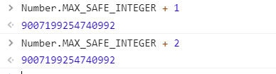

## 黑马头条PC-面包屑组件封装

> 封装面包屑组件, 借用 elementUI 封装一个适合自己的小组件

在 

**`思路-步骤`**

* 

* 

* 

* >

  具体的实现代码
  
  ```html
  <template>
  <!-- 使用elementUI的 面包屑  设置分隔符-->
    <el-breadcrumb separator=">">
        <!-- el-breadcrumb-item 相当于 router-link标签 -->
       <el-breadcrumb-item to="/home">首页</el-breadcrumb-item>
       <!-- 第二个选项是动态的  需要采用传值的方式传进来 props传值 slot插槽(采用) -->
       <el-breadcrumb-item>
           <!-- 内容是动态的 -->
           <!-- 定义一个具名插槽 -->
           <slot name='title'></slot>
       </el-breadcrumb-item>
    </el-breadcrumb>
  </template>
  
  <script>
  export default {
  
  }
  </script>
  
  <style>
  
  </style>
  
  ```


## 黑马头条PC-评论列表-新建页面-挂载路由

**`思路-步骤`**

* 二级路由组件 评论管理 => 路由级组件

> 路由级组件一般放置在哪个目录?  views(pages)! 

* 挂载到路由表上

>  挂载到路由表上,采用一种新的引入方式

按需加载的意思是:  当需要组件的时候,才去加载组件 内容

* ```json
   {
        //   path:'/home/comment', // 完整地址 评论列表的地址
          path: 'comment', // 简写地址
          component: () => import('@/views/comment') // 按需加载的方式
   }
   ```

  


## 黑马头条PC-评论列表-页面结构-table

**`思路-步骤`**

> 页面结构    面包屑  +  表格

 ```html
  <template>
  <!-- 用一个el-card组件做主页面 -->
   <el-card>
      <!-- 放置一个面包屑组件  slot='header' 表示面包屑会作为具名插槽给card的header部分-->
      <bread-crumb slot='header'>
      <!-- slot='title' 表示 评论管理给面包些的插槽 -->
         <template slot="title">
             评论管理
         </template>
      </bread-crumb>
      <!-- 表格组件 -->
      <el-table :data="list">
         <!-- 使用el-table-column作为列 -->
         <!-- prop 表示显示的字段 label表示表头 -->
         <el-table-column width="600"  label="标题"></el-table-column>
         <el-table-column  label="评论状态"></el-table-column>
         <el-table-column  label="总评论数"></el-table-column>
         <el-table-column  label="粉丝评论数"></el-table-column>
         <el-table-column  label="操作"></el-table-column>
      </el-table>
   </el-card>
</template>
  
  <script>
  export default {
    data () {
      return {
        list: [
  
        ]
      }
    }
  }
  </script>
  
  <style>
  
  </style>
  
 ```


## 黑马头条PC-评论列表-评论数据加载到页面及状态过滤

**`步骤-思路`**  

* 接口  => 有!
* 工具 => axios

> 先要通过 接口获取评论数据

先定义一个 获取评论数据的方法

```js
  methods: {
    //   获取评论数据
    getComment () {
      this.$axios({
        url: '/articles', // 请求地址
        params: {
          response_type: 'comment' // 此参数用来控制获取数据类型
        }
        // query参数应该在哪个位置传 axios
        // params 传get参数也就是query参数
        // data   传body参数也就是请求体参数
      }).then(result => {
        console.log(result)
      })
    }
  }
```

> 给el-table-column配置 prop属性

```vue
   <el-table :data="list">
       <!-- 使用el-table-column作为列 -->
       <!-- prop 表示显示的字段 label表示表头 -->
       <el-table-column prop="title" width="600"  label="标题"></el-table-column>
       <el-table-column prop="comment_status" label="评论状态"></el-table-column>
       <el-table-column  prop="total_comment_count" label="总评论数"></el-table-column>
       <el-table-column prop="fans_comment_count" label="粉丝评论数"></el-table-column>
       <el-table-column  label="操作">
          <!-- 可以放组件 -->
          <el-button size="small" type='text'>修改</el-button>
          <el-button size="small" type='text'>关闭评论</el-button>

       </el-table-column>
    </el-table>
```

> 但是发现个问题, 评论状态不显示

el-table  => 不显示布尔值

> 怎么办呢 ?  el-table提供了列的格式化工具,可以将布尔值转化成显示其他的值 比如 **`打开/关闭`**

el-table-column 提供了一个属性 **`formatter`**

> 我们根据 布尔值 在formatter中决定显示  **`打开 / 关闭`**

```js
    //  定义一个格式化的函数
    formatterBool (row, column, cellValue, index) {
      //  row 代表当前的一行数据
      // column 代表当前的列信息
      // cellValue 代表当前单元格的值
      // index 代表当前的索引
      // 该函数需要返回一个值 用来显示
      return cellValue ? '正常' : '关闭'
    }
```

## 黑马头条PC-评论列表-打开和关闭评论

> 打开/关闭评论的接口 

接口 有!

> 用axios请求

我们需要根据评论状态决定是打开评论还是关闭评论

> 操作的状态 与当前的状态**`是相反的`**!

首先得要解决 打开评论和关闭评论显示的问题

```vue
       <el-table-column  label="操作">
          <!-- el-table-column组件 在插槽中传出了 row $index store column -->
          <!-- 插槽 -> 作用域插槽 ->子组件中的数据 通过插槽传出 slot-scope接收  row(行数据) $index(索引)  -->
          <!-- 可以放组件 -->
          <template slot-scope="obj">
            <el-button size="small" type='text'>修改</el-button>
             <!-- 文本内容要根据 当前行里面的评论状态决定显示还是隐藏 -->
            <el-button size="small" type='text'>{{ obj.row.comment_status ? '关闭' : '打开'}}评论</el-button>
          </template>

       </el-table-column>
```

> 需要给按钮注册事件, 点击打开或者关闭评论,调用接口

```js
    //  打开或者关闭逻辑
    openOrClose (row) {
      const mess = row.comment_status ? '关闭' : '打开'
      // $confirm 也支持 promise 点击确定会进入到then 点击取消会进入到catch
      this.$confirm(`是否确定${mess}评论`, '提示').then(() => {
        // 调用打开或者关闭接口
        this.$axios({
          url: '/comments/status', // 请求地址
          method: 'put', // 请求类型
          // query参数
          params: {
            article_id: row.id // 要求参数的文章id
          },
          data: {
            //  body参数
            allow_comment: !row.comment_status // 是打开还是关闭  此状态和评论状态相反
          }
        }).then(() => {
          //   成功了 提示个消息 然后 重新拉取数据4
          this.$message.success(`${mess}评论成功`)
          //  重新拉取数据
          this.getComment() // 调用重新拉取数据的方法
        }).catch(() => {
          //   表示失败了 会进入到catch
          this.$message.error(`${mess}评论失败`)
        })
      })
    }
```

> 上面代码写完,有的成功,有的失败, 因为 我们传id发生了变化

这里面涉及到  前端的一个 大数字,  因为我们的id超过了大数字的限制,所以出现了id的**`计算失真`**

我们写完的代码 虽然没有逻辑问题,但是 不能保证打开或者评论成功

> 怎么解决 ? 

通过处理大数字类型来解决

## 黑马头条PC-统一处理大数字类型

**`步骤-思路`**

[js数据精度](https://juejin.im/post/5af3f84bf265da0b7c074be6)

- 在JavaScript处理整数的时候会遇到某些**`特别奇怪`**的问题,比如后台给你返回了一个超长的数字,然后js在计算的时候突然发现计算不对,不是后面为0就是计算得不到想要的结果.这里涉及到一个很简单的知识 也就是NUMBER的安全整数.

- javascript => 计算数字的时候 =>安全范围 => 如果超过了一定的数字大小 => 计算就会失真=>就会不正确

- 安全范围=> 最大安全整数 => 最大安全数字=> 如果超过了最大安全数字  => 计算就会有问题

- ```js
  Number.MAX_SAFE_INTEGER // 9007199254740991
  9007199254740991+2 // 9007199254740992
  ```

- 后端 => 前端 => 字符串 =>对象 => JSON.parse() => 如果超出了最大安全数字 => 计算偏差 =>JSON.parse不精确(一旦超过最大安全整数)  =>  axios 自动调用的  => 转化方法 =>json.parse()

- json.parse =>处理大数字的时候 => 计算偏差  => 找出替代方案 => 第三方的转化包 => 保证数字的不丢,计算正常

- js的数字有  最大安全数值

  - 2的53次方

  - Number.MAX_SAFE_INTEGER

  - 在运算 或 json对象转换的时候会有误差

  - 运算的时候：

    

  - json对象转换的时候：

    

- json-bigint  npm的包

  - 看文档 
  - **`npm i json-bigint`**
  - import JSONBig from 'json-bigint'
  - JSONBig .parse('json数据')  会将 我们的数字转化成一个 大数字类型对象

- 在哪里使用：

  - 原来 是axios默认转换的数据  **`JSON.parse`**()
  - 现在 使用自定义的方式来转换数据

>transformResponse 是axios 的一个数组 .数组中可以写多个处理函数 它发生了 后端数据  => transformResponse     => axios的响应拦截器之前  =>  axios.then

```js
 // `transformResponse` 在传递给 then/catch 前，允许修改响应数据
  transformResponse: [function (data) {
    // 对 data 进行任意转换处理

    return data;
  }],
```

**`结论`**后端传会的id数字超过了前端的**`最大安全数字`**的限制,导致JSON.parse以及其他运算失败.需要第三方的转化包,

**`json-bigint`**, => 调用接口  => OK

```js
axios.defaults.transformResponse = [function (data) {
// data 是响应回来的字符串
  return data ? JSONBig.parse(data) : {} // 解决js处理大数字失真问题}]
```

JSON.parse  => JSONbig.parse()

## 黑马头条PC-评论列表-列表分页及请求

**`步骤-思路`**

> 在element-ui 的页面中, 一般都用element的分页组件

放置一个分页组件

```html
 <el-row type='flex' justify="center" align="middle" style="height:80px">
      <!-- 分页组件 total 总页码  每页多少条-->
      <el-pagination background layout="prev, pager, next"
       :current-page="page.currentPage"
       :page-size="page.pageSize"
       :total="page.total"
       @current-change="changePage"
       ></el-pagination>
    </el-row>
```

> 一般来说,分页组件需要的参数 我们单独的放置一个对象

```js
 page: {
        total: 0, // 默认总数是0
        currentPage: 1, // 默认的页码 是第一个页  决定了当前页码是第几页
        pageSize: 10 // page-size的默认值是10
  },
```

> 以上是分页的必要的要素

* total  => 总条数 
* page-size => 每页多少条
* current-page => 当前页码

> 接下里应该捕获页码的改变事件  current-change

监听页码改变事件 current-change

* @current-change => 当前页码改变触发的事件 => 将最新页码 赋值给当前页码 => 请求数据

* ```js
   // 页码改变事件  newPage就是点击切换的最新页码
      changePage (newPage) {
        // newPage是最新的切换页码
        // 将最新的页码 设置给 page下的当前页码
        this.page.currentPage = newPage // 赋值最新页码
        // 重新拉取数据
        this.getComment() // 获取评论
      },
  ```
  
  > 获取评论的代码
  
  ```js
      //   获取评论数据
      getComment () {
        this.$axios({
          url: '/articles', // 请求地址
          // 接口 如果你不传分页数据 默认查第一页的数据
          params: {
            response_type: 'comment', // 此参数用来控制获取数据类型
            page: this.page.currentPage, // 查对应页码
            per_page: this.page.pageSize // 查10条
          }
          // query参数应该在哪个位置传 axios
          // params 传get参数也就是query参数
          // data   传body参数也就是请求体参数
        }).then(result => {
          //  将返回结果的中 数组 给list
          this.list = result.data.results
          // 在获取完数据之后 将 总数赋值给 total
          this.page.total = result.data.total_count // 将总数赋值
        })
      },
  ```
  
  

## 黑马头条PC-评论列表-加载状态

**`步骤-思路`** 

> 我们需要 加个 遮罩层, 想要实现当 数据还没有加载完成的时候,显示遮罩层

element-UI 提供了遮罩层 v-loading

Element 提供了两种调用 Loading 的方法：指令和服务。对于自定义指令`v-loading`，只需要绑定`Boolean`即可

**`指令不同于属性, 属性加冒号是变量, 指令不需要加冒号 就是 变量`**

> 在data中定义变量, 在视图中绑定变量

```vue
 <el-card v-loading="loading">
  loading: false // 控制loading遮罩层的显示或者隐藏

```

> 需要 在 请求之前, 将loading  打开, 请求数据完毕之后 关闭

* v-loading ="变量"

* 通过变量 布尔值  => 进度条打开还是关闭

* ```js
  //   获取评论数据
      getComment () {
        this.loading = true // 打开遮罩层
        this.$axios({
          url: '/articles', // 请求地址
          // 接口 如果你不传分页数据 默认查第一页的数据
          params: {
            response_type: 'comment', // 此参数用来控制获取数据类型
            page: this.page.currentPage, // 查对应页码
            per_page: this.page.pageSize // 查10条
          }
          // query参数应该在哪个位置传 axios
          // params 传get参数也就是query参数
        // data   传body参数也就是请求体参数
        }).then(result => {
          //  将返回结果的中 数组 给list
          this.list = result.data.results
          // 在获取完数据之后 将 总数赋值给 total
          this.page.total = result.data.total_count // 将总数赋值
          this.loading = false // 请求完毕 关闭遮罩层
        })
      },
  ```
  
  
  

## 黑马头条PC-素材列表-新建页面-挂载路由

**`步骤-思路`**

> 新建views组件

```html
<template>
<!-- el-card布局 -->
   <el-card>
        <!-- 放置面包屑  将 面包屑给到卡片的具名header-->
        <bread-crumb slot='header'>
            <!-- 具名插槽 template不生成任何实质标签-->
            <template slot='title'>
                素材管理
            </template>
        </bread-crumb>
   </el-card>
</template>

<script>
export default {

}
</script>

<style>

</style>

```


## 黑马头条PC-素材列表-页面结构-tab

**`步骤-思路`**

> 通过使用 el-tabs标签页 ,放置两个 tab页, 分别是 全部素材 和收藏素材

```html
  <!-- 放置标签页 v-model所绑定的值 就是当前所激活的页签-->
        <el-tabs v-model="activeName">
            <!-- 放置标签 label表示标签显示的名称 name代表页签的选中的值-->
            <el-tab-pane label="全部素材" name='all'>
                <!-- 内容 -->
                全部素材
            </el-tab-pane>
            <el-tab-pane label="收藏素材" name='collect'>
                <!-- 内容 -->
                收藏素材
            </el-tab-pane>

        </el-tabs>
```


## 黑马头条PC-素材列表-数据加载

> 需要通过接口 来 获取 全部 素材 和收藏素材的数据

接口 中 collect 变量 如果为true ,表示获取的是 收藏的数据,如果false表示获取的全部的数据

> 第一步,我们先在data中定义一个list来接收全部素材的数据

```js
  data () {
    return {
      activeName: 'all', // 当前激活的页签 默认选中全部素材
      list: [] // 全部素材的数据 接收全部素材
    }
  }
```

> 接下来, 定义一个获取素材的方法, 从接口中获取数据 并赋值给 list 

```js
  methods: {
    //   获取素材数据
    getMaterial () {
      this.$axios({
        url: '/user/images', // 请求地址
        params: {
          collect: false // 获取不是收藏的数据 就是获取全部的数据
        }, // get参数 也就是query参数
        data: {} // data参数 放的是body参数
      }).then(result => {
        // 将返回的数据 赋值到data中的数据
        this.list = result.data.results
      })
    }
  },
  created () {
    // 实例化之后 调用获取素材数据
    this.getMaterial() // 获取素材数据
  }
```

> 需要实现 将数据转化成 页面的结构 

```vue
  <!-- 放置标签页 v-model所绑定的值 就是当前所激活的页签-->
        <el-tabs v-model="activeName">
            <!-- 放置标签 label表示标签显示的名称 name代表页签的选中的值-->
            <el-tab-pane label="全部素材" name='all'>
                <!-- 内容 循环生成页面结构 -->
                <div class='img-list'>
                    <!-- 采用v-for对list数据进行循环 -->
                    <el-card class='img-card' v-for="item in list" :key="item.id">
                        <!-- 放置图片 并且赋值 图片地址-->
                        
                        <!-- 操作栏 可以flex布局-->
                        <el-row class='operate' type='flex' align="middle" justify="space-around">
                           <i class='el-icon-star-on'></i>
                           <i class='el-icon-delete-solid'></i>
                        </el-row>
                    </el-card>
                </div>
            </el-tab-pane>
            <el-tab-pane label="收藏素材" name='collect'>
                <!-- 内容 -->
                收藏素材
            </el-tab-pane>

        </el-tabs>
```

>样式部分

```less
  .img-list {
      display: flex;
      flex-wrap: wrap;
      justify-content: center;
      .img-card {
          width: 220px;
          height: 240px;
          margin: 20px 40px;
          position: relative;
          img {
              width: 100%;
              height: 100%;
          }
          .operate {
              position: absolute;
              left:0;
              bottom:0;
              width: 100%;
              background: #f4f5f6;
              height: 30px;
              i  {
                  font-size:20px;
              }
          }
      }
  }
```

> 接下来做收藏部分的数据, 我们发现 收藏 和全部非常像, 只是没有 操作栏

我们首先拷贝同样的结构到收藏的部分, 但是把操作栏去掉, 数据部分怎么办?

> 这里 收藏 和全部 要公用一个list数据, 为什么?

由于当前只能看到一个页签 ,所以当点击页签时 ,就去加载点击页签的数据,就可以保证数据的正确

> 也就是 点击 全部,将全部的数据赋值给 list. 点击收藏 将收藏的数据给list

接下来需要在 tabs切换事件中, 进行响应的数据加载

```js
 // 切换页签事件
    changeTab () {
      // 在切换事件中
    // 可以根据当前 activeName来决定是获取哪个方面 的数据
    // activeName === 'all' 获取所有的素材  activeName = 'collect' 获取收藏素材
      this.getMaterial() // 直接调用获取素材的方法
    }
```

> 对 获取素材数据进行如下的修改

```js
 getMaterial () {
      this.$axios({
        url: '/user/images', // 请求地址
        params: {
          collect: this.activeName === 'collect' //  这个位置应该变活 根据当前的页签变活   activeName === 'all' 获取所有的素材  activeName = 'collect' 获取收藏素材
        }, // get参数 也就是query参数
        data: {} // data参数 放的是body参数
      }).then(result => {
        // 将返回的数据 赋值到data中的数据
        this.list = result.data.results
      })
    },
```


## 黑马头条PC-素材列表-分页组件及请求

**`步骤-思路`**

> 分页 和评论管理一个套路

* 收藏 =>  全部 公用了一个list

> 分页也可以共用一个

需要放置一个公共的分页组件, 在tab页 的下方

* 切换tab页  =>  根据tab页name去查询对应的分类数据 =>  total_count(总数)

* ```html
    <!-- 放置一个公共的分页组件 -->
          <el-row type='flex' justify="center" style='height:80px' align="middle">
              <!-- 放置分页组件
                total  总条数
                current-page 当前页码
                page-size 每页多少条
              -->
              <el-pagination background
                :total="page.total"
                :current-page="page.currentPage"
                :page-size="page.pageSize"
                layout="prev, pager, next"
              ></el-pagination>
        </el-row>
  ```

> 应该在请求完毕之后,将总条数赋值给total

```js
    //   获取素材数据
    getMaterial () {
      this.$axios({
        url: '/user/images', // 请求地址
        params: {
          collect: this.activeName === 'collect', //  这个位置应该变活 根据当前的页签变活   activeName === 'all' 获取所有的素材  activeName = 'collect' 获取收藏素材
          page: this.page.currentPage, // 取页码变量中的值 因为只要页码变量一变 获取的数据跟着变
          per_page: this.page.pageSize // 获取每页数量

        }, // get参数 也就是query参数
        data: {} // data参数 放的是body参数
      }).then(result => {
        // 将返回的数据 赋值到data中的数据
        this.list = result.data.results
        // 将总条数赋值给total变量
        this.page.total = result.data.total_count // 总数  全部素材的总数  收藏素材的总数 总数 跟随 当前页签变化而变化
      })
    },
```

> 当切换分类的时候,我们应该将页码重置成第一页, 因为换了分类, 数据源发生了变化

```js
   // 切换页签事件
    changeTab () {
      this.page.currentPage = 1 // 将页码重置为第一页 因为分类变了 数据变了
      // 在切换事件中
      // 可以根据当前 activeName来决定是获取哪个方面 的数据
      // activeName === 'all' 获取所有的素材  activeName = 'collect' 获取收藏素材
      this.getMaterial() // 直接调用获取素材的方法
    }
```

## 黑马头条PC-素材列表-素材的上传

**`步骤-思路`**

* 上传接口 => 接口 formdata类型
* 上传组件 => elementUI => upload

```vue
 <el-row type='flex' justify="end">
          <!-- 上传组件要求必须传action属性 不传就会报错 可以给一个空字符串-->
          <el-upload action="">
           <el-button size="small" type='primary'>上传素材</el-button>
           <!-- 传入一个内容 点击内容就会传出上传文件框 -->
          </el-upload>
        </el-row>
```

> 放置好上传组件, 可以通过自定义上传的方法 ,当选择文件之后, 通过方法进行上传

通过多http-request属性绑定一个函数 uploadImg

* ```js
   // 定义一个上传组件的方法
      uploadImg (params) {
        //  params.file 就是需要上传的图片文件
        // 接口参数类型要求是 formData
        const data = new FormData() // 实例化一个formData对象
        data.append('image', params.file) // 加入文件参数
        // 开始发送上传请求了
        this.$axios({
          url: '/user/images', // 请求地址
          method: 'post', // 上传或者新增一般都是post类型
          data // es6简写
        }).then(() => {
          // 如果成功了 我们应该 重新来取数据啊
          this.getMaterial()
        }).catch(() => {
        this.$message.error('上传素材失败')
        })
      },
  ```
  
  

## 黑马头条PC-素材列表-素材的收藏和删除

**`步骤-思路`**

> 通过点击 收藏和删除的图标 ,触发相应的动作

应该给图片注册事件 , 注册点击事件,绑定 收藏和删除的方法

```js
    // 删除素材的方法
    delMaterial () {},
    // 取消或者收藏素材
    collectOrCancel () {},
```

> 应该给方法传递参数

```js
   // 删除素材的方法
    delMaterial (row) {},
    // 取消或者收藏素材
    collectOrCancel (row) {},
```

> 实现收藏和取消收藏的逻辑

需要根据数据中**`is_collected`** 控制收藏图片 的颜色  true  => 红色  false  => 黑色

```vue
         <i @click="collectOrCancel(item)" :style="{color: item.is_collected ? 'red' : 'black'}" class='el-icon-star-on'></i>

```

```js
 // 取消或者收藏素材
    collectOrCancel (row) {
      // 调用收藏和取消收藏接口
      this.$axios({
        method: 'put', // 请求类型
        url: `/user/images/${row.id}`, // 请求地址
        data: {
          collect: !row.is_collected // true  or false  ?  取反 因为 收藏 => 取消收藏 没收藏  => 收藏
        } // 放置body参数
      }).then(() => {
        //  成功了应该干啥
        this.getMaterial() // 重新加载数据
      }).catch(() => {
        this.$message.error('操作失败')
      })
    },
```

> 删除逻辑 ,点击图标的时候, 提示一下, 调用删除接口, 删除成功之后,重新拉取数据

```js
 // 删除素材的方法
    delMaterial (row) {
      //  删除之前 应该友好的问候一下 是不是需要删除 ?
      // confirm 也是promise
      this.$confirm('您确定要删除该图片吗?', '提示').then(() => {
        //  如果 确定删除  直接调用删除接口
        this.$axios({
          method: 'delete', // 请求类型 删除
          url: `/user/images/${row.id}` // 请求地址
        }).then(() => {
        //  成功了应该干啥
          this.getMaterial() // 重新加载数据
          //  如果删除成功了 可以重新拉取数据 也可以 在前端删除  会在 移动端进行场景演示
          // C 端场景  如果删除 或者修改数据 不会重新拉取数据 只会在前端修改对应的一条数据
          // B 端场景 可以拉取数据
        }).catch(() => {
          this.$message.error('操作失败')
        })
      })
    },
```


## 黑马头条PC-素材管理-预览

> 现在素材管理做好了, 但是大家只能看到小图,看不到大图,接下来,我们尝试做一下图片的幻灯片预览

当我们点击图片的时候, 弹出一个层, 层里面是可以前后切换的大图

>   需要用到element-UI 的走马灯组件, 和弹层组件

弹层组件,用到el-dialog

>  需要放置一个 el-dialog组件

el-dialog采用 visible 属性控制显示隐藏.关闭的时候需要通过函数 close来关闭

>  @事件名="方法" 还可以 跟简单逻辑   @事件名="属性 = 值"

需要点击图片的时候,  弹出弹层

>  需要在 el-dialog 中放置内容, 放置走马灯组件

在走马灯中放置循环的图片

```vue
 <el-dialog :visible="dialogVisible" @close="dialogVisible = false">
          <!-- 放置一个走马灯组件 -->
          <el-carousel indicator-position="outside" height="400px">
             <!-- 放置幻灯片循环项  根据 当前页list 循环-->
             <el-carousel-item v-for="item in list" :key="item.id">
                <!-- 放置图片 -->
                 
             </el-carousel-item>
          </el-carousel>
        </el-dialog>
```

>发现 一个问题, 点击弹出层,并不能切换到显示点击图片

我们需要将点击的图片的索引 记录下来,  因为 走马灯可以通过设置索引切换幻灯片  **`setActiveItem`**

我们在点击图片中,记录索引

```js
    selectImg (index) {
      this.clickIndex = index // 将索引赋值
      this.dialogVisible = true // 打开索引
    },
```

>  索引记录了, 什么时候调用? 

需要调用 组件实例的方法  **`setActiveItem`**, 这个时候需要用到ref 

ref 可以获取组件实例

>  为什么 直接获取ref开始不行,后来可以? 

因为el-dialog中的组件 是懒加载, 也就是第一次初始化的时候, 你没有弹出对话框之前 , ref不存在

>   怎么解决 ?   我们可以在 dialog的opend 函数中进行处理,因为opend函数执行的时候, 表示所有的东西渲染完毕

```vue
 <!-- 放置一个el-dialog组件 通过visible 属性进行true false设置 -->
        <el-dialog @opened="openEnd" :visible="dialogVisible" @close="dialogVisible = false">
          <!-- 放置一个走马灯组件 -->
          <el-carousel ref="myCarousel" indicator-position="outside" height="400px">
             <!-- 放置幻灯片循环项  根据 当前页list 循环-->
             <el-carousel-item v-for="item in list" :key="item.id">
                <!-- 放置图片 -->
                 
             </el-carousel-item>
          </el-carousel>
        </el-dialog>
```

```js
openEnd () {
      // 这个时候已经打开结束 ref已经有值 可以通过ref进行设置了
      this.$refs.myCarousel.setActiveItem(this.clickIndex) // 尝试通过这种方式设置index
    },
```

