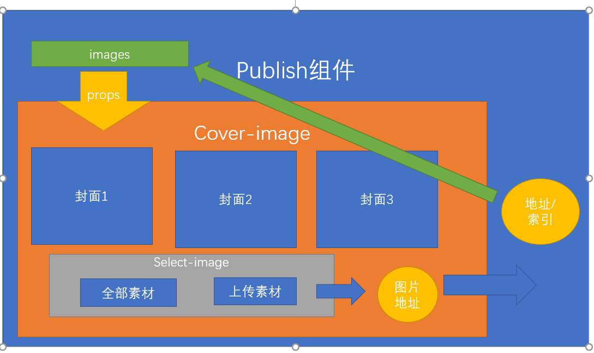

## 黑马头条PC-内容列表-新建页面-挂载路由

**`思路-步骤`**

* 新建一个路由级组件 
* 挂载到二级路由上 => 按需加载

## 黑马头条PC-内容列表-页面结构-搜索工具栏

**`思路-步骤`**

* 表单容器 => model   rules => el-form => 这些属性是校验时必须写的,一般的绑定不需要写

>  

* ```html
   <el-form style="padding-left:50px">
           <el-form-item label="文章状态:">
             <!-- 放置单选框组 -->
             <el-radio-group>
               <!-- 单选框选项 -->
               <el-radio>全部</el-radio>
               <el-radio>草稿</el-radio>
               <el-radio>待审核</el-radio>
               <el-radio>审核通过</el-radio>
               <el-radio>审核失败</el-radio>
             </el-radio-group>
           </el-form-item>
           <el-form-item label="频道类型:">
             <!-- 选择器 -->
             <el-select placeholder="请选择频道"></el-select>
           </el-form-item>
           <el-form-item label="日期范围:">
             <!-- 日期范围选择组件  要设置type属性为 daterange-->
             <el-date-picker type='daterange'></el-date-picker>
           </el-form-item>
        </el-form>
    </el-card>
  ```
  
>  要对结构进行数据的绑定, 需要根据接口对数据进行分析 绑定

  先建立数据对象

  ```js
   searchForm: {
          // 数据
          // 文章状态，0-草稿，1-待审核，2-审核通过，3-审核失败，4-已删除，不传为全部 / 先将 5 定义成 全部
          // 传值的是时候如果是5 就不传
          status: 5, // 默认为全部的状态
          channel_id: null // 表示没有任何的频道
        }
  ```

  对 文章状态进行 绑定, 

  ```vue
  <el-radio-group v-model="searchForm.status">
               <!-- 单选框选项  label值表示该选项对应的值-->
               <!-- :label的意思是后面值不会加引号 -->
                <!-- 文章状态，0-草稿，1-待审核，2-审核通过，3-审核失败，不传为全部 / 先将 5 定义成 全部 -->
  
               <el-radio :label="5">全部</el-radio>
               <el-radio :label="0">草稿</el-radio>
               <el-radio :label="1">待审核</el-radio>
               <el-radio :label="2">审核通过</el-radio>
               <el-radio :label="3">审核失败</el-radio>
             </el-radio-group>
  ```

  >  频道列表的数据需要通过接口获取

  ```js
    // 获取频道数据
      getChannels () {
        this.$axios({
          url: '/channels'
        }).then(result => {
          // 获取频道接口返回的数据
          this.channels = result.data.channels
        })
      }
  ```

  >  钩子函数 created中调用

  绑定完成的最终代码是

  ```vue
    <el-card>
        <bread-crumb slot='header'>
            <template slot='title'>文章列表</template>
        </bread-crumb>
        <!-- 搜索工具栏 筛选 -->
        <!-- 表单容器 -->
        <el-form style="padding-left:50px">
           <el-form-item label="文章状态:">
             <!-- 放置单选框组 -->
             <el-radio-group v-model="searchForm.status">
               <!-- 单选框选项  label值表示该选项对应的值-->
               <!-- :label的意思是后面值不会加引号 -->
                <!-- 文章状态，0-草稿，1-待审核，2-审核通过，3-审核失败，不传为全部 / 先将 5 定义成 全部 -->
  
               <el-radio :label="5">全部</el-radio>
               <el-radio :label="0">草稿</el-radio>
               <el-radio :label="1">待审核</el-radio>
               <el-radio :label="2">审核通过</el-radio>
               <el-radio :label="3">审核失败</el-radio>
             </el-radio-group>
           </el-form-item>
           <el-form-item label="频道类型:">
             <!-- 选择器 -->
             <el-select placeholder="请选择频道" v-model="searchForm.channel_id">
               <!-- 下拉选项 应该通过接口来获取数据 -->
               <!-- el-option是下拉的选项 label是显示值  value是绑定的值 -->
               <el-option v-for="item in channels" :key="item.id" :label="item.name" :value="item.id"></el-option>
             </el-select>
           </el-form-item>
           <el-form-item label="日期范围:">
             <!-- 日期范围选择组件  要设置type属性为 daterange-->
             <el-date-picker type='daterange' v-model="searchForm.dateRange"></el-date-picker>
           </el-form-item>
  
        </el-form>
    </el-card>
  ```

  

  

## 黑马头条PC-内容列表-页面主体结构

>  

**`思路-步骤`**

* 手写的方式 实现页面的主题结构

* ```html
   <div class="article-item" v-for="item  in 100" :key="item">
           <!-- 左侧内容 -->
           <div class="left">
               
               <div class="info">
                 <span>我爱我的祖国</span>
                 <el-tag class='tag'>已发表</el-tag>
                 <span class='date'>2020-02-18 10:12:19</span>
               </div>
           </div>
           <!-- 右侧内容 -->
           <div class="right">
             <span><i class="el-icon-edit"></i> 修改</span>
             <span><i class="el-icon-delete"></i> 删除</span>
           </div>
         </div>
  ```
  
  样式部分
  
  ```less
   .articles {
        .total {
          height: 60px;
          border-bottom: 1px dashed #ccc;
        }
        // 对文章循环项进行样式的编写
         .article-item {
           display: flex;
           justify-content: space-between;
           padding: 20px  0;
           border-bottom: 1px solid #ccc;
           .left {
             display: flex;
             img {
               width:180px;
               height: 100px;
               border-radius: 4px;
             }
             .info {
               display: flex;
               flex-direction: column;
               height: 100px;
               justify-content: space-around;
               margin-left: 10px;
               .date {
                 color: #999;
                 font-size:12px;
               }
               .tag {
                 width: 60px;
               text-align: center;
               }
             }
           }
           .right {
             span {
               font-size: 12px;
               margin-right: 8px;
               cursor: pointer;
               user-select: none;
             }
           }
         }
     }
  ```
  
  

## 黑马头条PC-内容列表-请求数据

**`思路-步骤`**

* 调用接口 =>先不做筛选,不做分页

>  调用完数据需要将 数据绑定到视图上


**`重点注意`**

 脚手架项目  写的源代码 都会被编译成 真实的运行代码 进行运行, 目录和名称都会变化

>  如果你给一个img标签 一个固定的地址,  地址所对应的文件 会被拷贝到一个对应的位置 ,使用

但是如果你 没有给一个图片固定地址, 而是采用了 判断 或者三元的写法, 这个时候 文件不会被拷贝及使用

>  怎么解决呢 ? 

可以先在data中 定义一个 变量,  用require()的方式 将图片转化成变量, 这个时候就可以使用了

```js
defaultImg: require('../../assets/img/default.gif') // 地址对应的文件变成了变量 在编译的时候会被拷贝到对应位置
```

```vue
 <!-- 列表内容 -->
      <!-- article-item 作为一个循环项 -->
       <div class="article-item" v-for="item  in  list" :key="item.id.toString()">
         <!-- 左侧内容 -->
         <div class="left">
           <!-- 设置文章的封面信息 有的数组有值 有的没值 搞一个默认值 -->
               <!--  -->
              <!--  采用变量的形式 赋值 -->
             
             <div class="info">
               <span>{{ item.title}}</span>
               <!-- 文章状态 0-草稿，1-待审核，2-审核通过，3-审核失败，4-已删除 -->
               <!-- 只是改变显示的格式 可以用过滤器   两个过滤器 分别处理   显示文本 和 标签类型-->
               <el-tag :type=" item.status | filterType" class='tag'>{{  item.status  | filterStatus}}</el-tag>
               <!-- 发布日期 -->
               <span class='date'>{{ item.pubdate }}</span>
             </div>
         </div>
         <!-- 右侧内容 -->
         <div class="right">
           <span><i class="el-icon-edit"></i> 修改</span>
           <span><i class="el-icon-delete"></i> 删除</span>
         </div>
       </div>
```

* 过滤器 不但可以用在插值表达式 

* 还可以用在 v-bind表达式

  

* ```js
      getArticles () {
        this.$axios({
          url: '/articles'
        }).then(result => {
          this.list = result.data.results // 获取文章列表数据
        })
      }
  ```

* 

## 黑马头条PC-内容列表-页面结构-搜索筛选

**`思路-步骤`**

>  我们已经加载了数据,但是并没有和搜索工具栏进行联通

接下来要做 和工具栏的联通问题

* 条件 => 组合条件 => 不论谁的数据发生变化 =>先组装条件  => 统一发送请求

* 第一种做法=>监听每个组件的change事件

* ```js
   // 改变了条件
      changeCondition () {
        // 当触发此方法的时候 表单数据已经变成最新的了
        // 组装条件 params
        const params = {
          // 文章状态，0-草稿，1-待审核，2-审核通过，3-审核失败，4-已删除，不传为全部
          status: this.searchForm.status === 5 ? null : this.searchForm.status, // 5 是我们前端虚构的
          channel_id: this.searchForm.channel_id, // 就是表单的数据
          begin_pubdate: this.searchForm.dateRange.length ? this.searchForm.dateRange[0] : null,
          end_pubdate: this.searchForm.dateRange.length > 1 ? this.searchForm.dateRange[1] : null
      }
        // 通过接口传入
        this.getArticles(params) // 直接调用获取方法
      },
  ```
  
* 第二种做法 => watch 去监听数据变化

>  watch  可以监听数据的变化, 监听谁 写谁的名字

如果监听对象呢? 如果对象里面套对象呢 ?

* ```js
  watch: {
      name: function(newValue,oldValue){
          
      }
  }
  // 传统模式  a: { b:{c:'123'} }
  watch:{
     "a.b.c":function(){}
  }
  watch: {
      a:{
          handler:function(){
              // this指向当前实例
          } // handler是一个固定写法 默认对象中任何的变化都会触发该函数
          deep: true // deep 深度检测 不论嵌套多少层 都可以监听到改变
      }
  }
  ```

  >  实施代码
  
  ```js
   // 监听data中的数据变化  第二种解决方案  watch监听对象的深度检测方案
    watch: {
      searchForm: {
        deep: true, // 固定写法 表示 会深度检测searchForm中的数据变化
        // handler也是一个固定写法 一旦数据发生任何变化 就会触发 更新
        handler () {
          //  统一调用改变条件的 方法
          this.changeCondition() // this 指向当前组件实例
        }
      }
    },
  ```
  
  

## 黑马头条PC-内容列表-分页请求

>  实现分页请求

放置分页组件,设置 total/page-size/current-page

```vue
   <!-- 放置分页组件 -->
       <el-row type='flex' justify="center" style='height:80px' align="middle">
             <!-- 分页组件 -->
             <el-pagination
              :current-page="page.currentPage"
              :page-size="page.pageSize"
              :total="page.total"
               background  layout='prev,pager,next'>
             </el-pagination>
       </el-row>
```

> 监听页码改变事件 @current-change

那么 切换页码的时候 需要带条件吗 ?

>  带! 应该带条件去翻页!

组装条件

> 条件改变的时候应该 回到第一页

```js
watch: {
    searchForm: {
      deep: true, // 固定写法 表示 会深度检测searchForm中的数据变化
      // handler也是一个固定写法 一旦数据发生任何变化 就会触发 更新
      handler () {
        //  统一调用改变条件的 方法
        this.page.currentPage = 1 // 只要条件变化 就变成第一页
        this.changeCondition() // this 指向当前组件实例
      }
    }
  },
```

> 页码改变 赋值新页码

```js
 // 改变页码事件
    changePage (newPage) {
      // 先将最新的页码给到 当前页码
      this.page.currentPage = newPage // 最新页码
      this.changeCondition() // 直接调用改变事件的方法
    },
```

> 切换条件的方法 

```js
  // 改变了条件
    changeCondition () {
      // 当触发此方法的时候 表单数据已经变成最新的了
      // 组装条件 params
      const params = {
        page: this.page.currentPage, // 如果条件改变 就回到第一页
        per_page: this.page.pageSize,
        // 文章状态，0-草稿，1-待审核，2-审核通过，3-审核失败，4-已删除，不传为全部
        status: this.searchForm.status === 5 ? null : this.searchForm.status, // 5 是我们前端虚构的
        channel_id: this.searchForm.channel_id, // 就是表单的数据
        begin_pubdate: this.searchForm.dateRange && this.searchForm.dateRange.length ? this.searchForm.dateRange[0] : null,
        end_pubdate: this.searchForm.dateRange && this.searchForm.dateRange.length > 1 ? this.searchForm.dateRange[1] : null
      }
      // 通过接口传入
      this.getArticles(params) // 直接调用获取方法
    },
```


## 黑马头条PC-内容列表-页面结构-删除内容

**`思路-步骤`**

****

> 自己的账户 不能发 正式内容,但是可以发草稿,可以用自己的账户测试删除草稿功能
>
> 139账户 发表的内容 可以不经过审核 就是正式内容

* 删除内容 => 只能删除 草稿 => 不能删除 已发表的  这是一种业务

* 注册删除的事件

* ```js
   // 删除素材方法
      delMaterial (id) {
      //  先友好的提示一下
        this.$confirm('您确定删除此条数据?', '提示').then(() => {
          // 如果进入了then 表示点击了确定
          this.$axios({
            method: 'delete',
            url: `/articles/${id}` // 地址 是  /articles/:target target 是文章id
          }).then(() => {
            // 如果删除成功了
            // 重新获取数据
          //  this.getArticles() // 如果这么写 就意味着你 舍去了当前的页码和条件 不能这么写
            // 应该带着条件和页码去加载
            this.changeCondition() // 重新加载
          }).catch(() => {
            this.$message.error('删除文章失败')
          })
        })
      },
   ```

  

## 黑马头条PC-发表文章-新建页面-挂载路由

**`思路-步骤`**

* 路由级组件
* 挂载二级路由  => 按需加载

## 黑马头条PC-发表文章-页面结构-简单实现

> 先简单实现一个表单

el-form =>  el-form-item => 组件

**`思路-步骤`**

```html
  <!-- 表单组件  标题宽度设置于 el-form组件-->
      <el-form style="margin-left:50px" label-width="100px">
        <el-form-item label="标题">
          <!-- 输入框 -->
          <el-input placeholder="请输入您的标题" style="width:60%"></el-input>
        </el-form-item>
        <el-form-item label="内容">
          <!-- 多行输入 -->
          <el-input placeholder="请输入您的内容" type='textarea' :rows="4"></el-input>
        </el-form-item>
        <el-form-item label="封面">
          <!-- 单选框组 -->
          <el-radio-group>
             <el-radio>单图</el-radio>
             <el-radio>三图</el-radio>
             <el-radio>无图</el-radio>
             <el-radio>自动</el-radio>
          </el-radio-group>
        </el-form-item>
        <el-form-item label="频道">
          <!-- select选择器 -->
          <el-select placeholder="请选择频道"></el-select>
        </el-form-item>
        <el-form-item>
          <!-- 放置两个按钮 -->
          <el-button type='primary'>发表</el-button>
          <el-button>存入草稿</el-button>
        </el-form-item>

      </el-form>
```


## 黑马头条PC-发表文章-频道数据加载

**`思路-步骤`**

> 定义数据 

通过接口调用频道数据 ，将数据加载给定义的数据 

> 绑定到select组件上

```js
export default {
  data () {
    return {
      channels: [] // 接收频道数据
    }
  },
  methods: {
    // 获取频道数据
    getChannels () {
      this.$axios({
        url: '/channels' // 获取频道数据
      }).then(result => {
        this.channels = result.data.channels // 将频道数据赋值给本地数据
      })
    }
  },
  created () {
    // 调用获取频道数据的方法
    this.getChannels()
  }
}
```

> 通过v-for 循环显示到 select的下拉选项上

```vue
<el-select placeholder="请选择频道">
              <!-- 下拉选项 v-for 循环生成 el-option-->
              <!-- label 显示值  value 保存值 -->
              <el-option v-for="item in channels" :label="item.name" :value="item.id"  :key="item.id"></el-option>
          </el-select>
```


## 黑马头条PC-发表文章-发布文章检验逻辑实现

**`思路-步骤`**

> 表单校验

1. 表单检验准备

> model 表单数据对象

```vue
 publishForm: {
        title: '', // 文章标题
        content: '', // 文章内容
        cover: {
          type: 0, // -1 是自动 0是无图  1 是单图 3 是三图
          images: [] // 字符串数组 对应type  假如 type 为1 images中应该有一个值 假如为3 images应该有三个值 0 images为空
        },
        channel_id: null // 频道id
  }
```

> rules  表单校验规则 

```js
      // 发布表单的校验规则
      publishRules: {}
```

> prop 设置el-form-item要校验的字段名

> 需要对组件使用v-model进行双向绑定

1. 表单规则编写

> 对表单的校验规则进行编写

**`required`**   必填项 

**`message`**  提示消息

**`pattern`**   正则表达式

**`validator`** 自定义校验函数

> 像类似 input 如果不想  一写内容就校验, 而是等到离开之后校验  怎么办 ?

**`trigger`**  触发类型 ,  什么时候触发校验规则  默认值 **`change`**(一发生改变 就校验) **`blur`**(只有离开当前焦点才会校验)

除了必填项之外, 还需要给 标题控制长度  title的长度区间是 5-30个字符, 

**`min`** => 校验 字符串的最低长度 针对于字符串  

**`max`**  => 校验字符串的最大长度  针对于字符串

**`min`** => 校验 数字的最小值 针对于整数

**`max`**  => 校验数字的最大值  针对于整数

> min /max针对不同的类型 处理不同的校验逻辑

```js
// 发布表单的校验规则
      publishRules: {
        title: [{ required: true, message: '文章标题不能为空', trigger: 'blur' }, {
          min: 5, max: 30, message: '标题应该在5-30字符之间', trigger: 'blur'
        }],
        content: [{ required: true, message: '文章内容不能为空', trigger: 'blur' }],
        channel_id: [{ required: true, message: '频道内容不能为空', trigger: 'blur' }]

      }
```


1. 手动校验表单

> 需要获取el-form组件实例, 调用validate方法  通过ref来做

```js
  // 发布
    publish () {
      //  this.$refs 来获取 el-form实例  调用validate方法
      this.$refs.myForm.validate()
    }
```


## 黑马头条PC-发表文章-发布文章

**`思路-步骤`**

> 发布按钮和草稿按钮的位置 , 调用发布文章接口

```vue
<el-button @click="publish(false)" type='primary'>发表</el-button>
  <el-button @click="publish(true)">存入草稿</el-button>
```

```js
 // 发布
    publish (draft) {
      //  this.$refs 来获取 el-form实例  调用validate方法
      // 回调形式
      // promise形式
      // this.$refs.myForm.validate(function (isOK) {
      //   if (isOK) {
      //     // 调用发布皆苦
      //   }
      // })
      this.$refs.myForm.validate().then(() => {
        // 如果进了then 表示校验成功
        // 调用发布接口
        this.$axios({
          method: 'post',
          url: '/articles', // 请求地址
          params: { draft }, // query参数
          data: this.publishForm // 请求体body参数
        }).then(() => {
          this.$message.success('发布成功!')
          // 如果发布成功
          this.$router.push('/home/articles') // 跳到文章列表
        }).catch(() => {
          this.$message.error('发布失败!')
        })
      })
    }
```

## 黑马头条PC-修改文章-发布页面-简单模式跳转

**`思路-步骤`**

> 文章列表 和发表文章 需要串联起来

发表文章页面  承载两个功能,  新增, 修改文章

> 点击文章列表 => 修改  => 跳转到发布文章

路由中的传值

动态路由传值 

> 先给路由规则 加上 参数 

```js
 {
        path: 'publish/:articleId?', // 发布文章 加上问号表示 可有可无
        component: () => import('@/views/publish') // 引入组件
  }
```

> 对修改标签进行事件处理

```vue
 <span @click="$router.push(`/home/publish/${item.id.toString()}`)"><i class="el-icon-edit"></i> 修改</span>

```

## 黑马头条PC-修改文章-逻辑实现

**`思路-步骤`**

> 已经调到了 发布文章页面

已经完成了发布场景, 再增加一种修改文章的场景

> 应该在进入页面之后, 根据id将当前文章的数据加载出来

```js
 // 根据id获取文章详情数据
    getArticleById (id) {
      //  获取数据
      this.$axios({
        url: `/articles/${id}` // 请求地址
      }).then(result => {
        this.publishForm = result.data // 将数据赋值给表单数据
      })
    },
```

> 上面的代码 将数据显示到了页面上, 下面 需要完成 保存数据的逻辑

但是需要知道,点击发表或者草稿的是时候  新增 / 修改

> 通过什么来判断是新增还是修改

```js
publish (draft) {
      //  this.$refs 来获取 el-form实例  调用validate方法
      // 回调形式
      // promise形式
      // this.$refs.myForm.validate(function (isOK) {
      //   if (isOK) {
      //     // 调用发布皆苦
      //   }
      // })
      this.$refs.myForm.validate().then(() => {
        const { articleId } = this.$route.params // 如果id 不为空 就是修改 如果为空就是发布新文章
        //  发布正式文章 发布草稿文章
        //  修改正式文章  修改草稿文章
        this.$axios({
          url: articleId ? `/articles/${articleId}` : '/articles', // 根据场景决定用什么地址
          method: articleId ? 'put' : 'post', // 根据场景决定用什么类型
          params: {
            draft
          },
          data: this.publishForm
        }).then(() => {
          this.$message.success('操作成功!')
          this.$router.push('/home/articles') // 跳到文章列表
        }).catch(() => {
          this.$message.error('操作失败!')
        })
        // if (articleId) {
        //   // 修改
        //   this.$axios({
        //     url: `/articles/${articleId}`, // 修改地址
        //     method: 'put',
        //     params: { draft },
        //     data: this.publishForm// 请求体参数
        //   }).then(() => {
        //     this.$message.success('发布成功!')
        //     this.$router.push('/home/articles') // 跳到文章列表
        //   }).catch(() => {
        //     this.$message.error('发布失败!')
        //   })
        // } else {
        // // 如果进了then 表示校验成功
        // // 调用发布接口
        //   this.$axios({
        //     method: 'post',
        //     url: '/articles', // 请求地址
        //     params: { draft }, // query参数
        //     data: this.publishForm // 请求体body参数
        //   }).then(() => {
        //     this.$message.success('发布成功!')
        //     // 如果发布成功
        //     this.$router.push('/home/articles') // 跳到文章列表
        //   }).catch(() => {
        //     this.$message.error('发布失败!')
        //   })
        // }
      })
    }
```


## 黑马头条PC-发布文章-注册富文本编辑器及应用

[编辑器地址](https://www.npmjs.com/package/vue-quill-editor)

推荐使用一个 vue-quill-editor的编辑器

> 先安装quill 编辑器

```bash
$ npm i  vue-quill-editor --save # 将编辑器安装到运行时依赖
```

> 接下来注册整个组件, 在统一注册的位置注册  **`components/index.js`**

```js
// 需要使用Vue.use的方式去注册
// Vue.use会调用对象中的install方法 install方法第一个参数 是Vue对象
import LayoutHeader from './home/layout-header'
import LayoutAside from './home/layout-aside'
import BreadCrumb from './common/bread-crumb'
import VueQuillEditor from 'vue-quill-editor'

// require styles
import 'quill/dist/quill.core.css'
import 'quill/dist/quill.snow.css'
import 'quill/dist/quill.bubble.css'
export default {
  install: function (Vue) {
    //   注册全局组件 Vue 一旦注册 在任意位置都可以使用
    Vue.component('layout-header', LayoutHeader) // 注册头部组件
    Vue.component('layout-aside', LayoutAside) // 注册左侧导航组件
    Vue.component('bread-crumb', BreadCrumb) // 注册一个面包屑组件
    // 注册 富文本编辑器
    Vue.use(VueQuillEditor)
  }
}

```

注册完毕,可以在任意位置使用组件了

> 此时你就可以使用一个名字**`quill-editor`**的组件了,这个组件我们应该拿去替换我们的 input
>
> quill-editor 支持使用v-model进行双向绑定

```vue
 <quill-editor v-model="publishForm.content"
             style="height:300px"
            ></quill-editor>
```

**`思路-步骤`**

## 黑马头条PC-发布文章-封面功能设计

> 封面功能 通过 cover字段中的 type类型来控制

-1 是自动 0是无图 1 是单图 3 是三图

> 也就是说 你需要在type =1的时候给后端传一张图片

>  type = 3的时候 传三张图片

>  type =0 或者 -1时  不传图片

所以我们需要根据 type值的变化进行 images中长度的变化

>  监听单选组的值改变事件 根据对应的值 生成对应的数组

```js
 // 改变类型事件
    changeType () {
      //  我们应该根据type的值对 images进行控制
      if (this.publishForm.cover.type === 1) {
        // 单图模式
        this.publishForm.cover.images = [''] // 此时还没有选择图片 所以 给一个空字符
      } else if (this.publishForm.cover.type === 3) {
        this.publishForm.cover.images = ['', '', ''] // 此时还没有选择图片 所以 给3个空字符
      } else {
        this.publishForm.cover.images = [] // 无图或者自动时 给一个空数组
      }
    },
```

> 数组已经生成了,接下来 需要根据images的长度生成对应的 图片列表

我们需要在下一节中 采用封装封面组件的方式 来实现

## 黑马头条PC-发布文章-封面功能实现

> images已经根据type进行了变化,需要封装一个封面组件 cover-image,目的是展示 images

在components下新建 publish文件夹,新建一个名为cover-image的组件

> 在 发布组件中 使用

因为 cover-image组件是用来 展示封面的, 所以说,需要把封面数据传给 cover-image

> 父组件 给子组件传值  props

```vue
 <cover-image :list="publishForm.cover.images"></cover-image>
```

> 在cover-image中根据images的长度 进行 循环 ,生成和长度对应的封面块

```vue
 <div class="cover-image">
      <!-- v-for循环 -->
      <div v-for="(item,index) in list" :key="index" class="cover-image-item">
          <!-- 图片的地址应该等于 item -->
          <!-- 一开始item是一个空字符串 因为此时还没有选择图片 此时应该根据 item是否有值 来决定显示默认图片还是item -->
          <!-- item如果没有值就显示 默认图片 -->
          <!-- img 如果不是固定地址的话 图片应该先转化成变量 -->
          
      </div>
  </div>
```

> 接下来,需要点击封面的图片,去选择封面,然后设置封面

注册封面块点击事件,点击时弹出一个层

```vue
 <el-dialog :visible="dialogVisible" @close="dialogVisible=false"></el-dialog>
```

> 有了弹层,弹层里面是 选择素材和上传素材的内容

接下来实现 选择素材和上传素材的内容

> 再次封装一个组件 select-image  ,负责选择图片 和上传图片

```vue
  <el-dialog :visible="dialogVisible" @close="dialogVisible=false">
          <!-- 会再次封装一个组件  选择图片的组件 -->
          <select-image></select-image>
      </el-dialog>
```

>  在select-image中, 完成选择素材 和上传素材功能

```js
getAllImg () {
      this.$axios({
        url: '/user/images',
        params: {
          collect: false, // 查询全部的素材 所以这里给一个false
          page: this.page.currentPage, // 当前页码
          per_page: this.page.pageSize // 每页多少条
        }
      }).then(result => {
        this.list = result.data.results // 获取全部素材的数据
        this.page.total = result.data.total_count // 将总数赋值给页码变量
      })
     // 改变页码
    changePage (newPage) {
      this.page.currentPage = newPage // 赋值新页码
      this.getAllImg() // 重新获取数据
    }
```

> 有了素材库的数据, 我们需要点击图片,然后将图片的地址 传给 上层组件显示

需要 子 => 父 ,  用自定义事件  this.$emit(事件名, 参数)

```js
  // 点击图片时触发
    clickImg (url) {
    //   需要将url参数传递给上层组件
    // 在脚手架中 自定义事件名 可以大小写通用 不用纯小写了
      this.$emit('selectOneImg', url) // 将url参数传出去
    }
```

> 封面组件接收到了 图片地址,发现 想要改封面,必须回到再上一级, 因为封面数据是props传递过来的,而props数据不允许被修改

```js
   // 接收传递的地址
    receiveImg (url) {
    //    拿到了图片地址之后应该干什么
      // props数据 不能直接修改 只能读取
        // 再次传递给 父组件 让父组件去修改 
    }
```

> 二次传递,将地址传给 publish组件`

```vue
        <cover-image @selectTwoImg="receiveImg" :list="publishForm.cover.images"></cover-image>

```

but!!!!我们现在只拿到了一个url地址,你如何去更新 一个images数组啊?

> 我们应该 点击哪一张图片, 然后选择完图片之后, 去设置这一张图片的地址

点击图片的时候, 可以记录点击的索引

```js
  //   点击图片时弹出一个层
    openDialog (index) {
      this.dialogVisible = true // 显示弹层
      this.selectIndex = index // 记录你点击了哪一张图片
    },
```

> 在publish组件中 完成对于 固定的索引的值的替换

```js
   // 接收cover-image传递过来的数据
    receiveImg (url, index) {
      // 接收到了 传递过来的封面数据
      // 接下来需要更新 images数组
      // but!!!!  仅仅拿到了一个url地址, 但是images可能有1条 可能有3条 单单有地址 并不足以 知道要更新哪一条记录
      //  有索引 有 url了 可以改变 数据了
      this.publishForm.cover.images.splice(index, 1, url) // 删除替换元素
      // splice(索引, 要删除的个数, 替换的个数)
    },
```

> 完成上传素材 之后 ,将上传成功的地址  再次设置给封面

```js
    // 上传素材
    uploadImg (params) {
      // 调用上传接口
      //  params.file 就是需要上传的图片文件
      // 接口参数类型要求是 formData
      const data = new FormData() // 实例化一个formData对象
      data.append('image', params.file) // 加入文件参数
      // 开始发送上传请求了
      this.$axios({
        url: '/user/images', // 请求地址
        method: 'post', // 上传或者新增一般都是post类型
        data // es6简写
      }).then(result => {
        // 如果成功了  此时 我们的接口会返回给我们一个上传成功之后的图片地址
        // 拿到了返回的url地址 应该做什么
        // 根刚才一样 往外传
        this.$emit('selectOneImg', result.data.url) // 将url参数传出去
      }).catch(() => {
        this.$message.error('上传素材失败')
      })
    }
```



## 新增文章和修改文章的跳转问题

> 目前做的新增文章 和修改文章还存在一点问题

从编辑的时候 跳转到 新增的时候

> 地址发生了变化,但是组件的内容并没有更新

提醒一下，当使用路由参数时，例如从 `/user/foo` 导航到 `/user/bar`，**原来的组件实例会被复用**。因为两个路由都渲染**`同个组件`**，比起销毁再创建，复用则显得更加高效。**不过，这也意味着组件的生命周期钩子不会再被调用**。

> 路由地址变了,但是组件没有变化, 组件实例会被复用, 也就是跳转过去之后,组件不会被销毁

不销毁组件 也就是以为钩子函数不会被执行, 但是如果不销毁的话,视图显示是不正确的

> 我们如何能够捕捉地址的变化呢?

我们可以watch 一下 $route对象, $route路由信息, 我们可以监视 $route的params参数, 如果params参数有变化,就可以重置组件


路由地址 变化  =>  组件的切换  =>  原来的组件被销毁  => 新来的组件被创建 

A 路由  => C组件  B路由 => C组件

A路由  =>B路由  =>  因为是同一个C组件,所以 C组件不会被销毁, 不销毁就意味着 该组件 不会重新执行created函数


所以需要通过 监视  $route的变化, 根据参数的变化 来决定是否 重置数据还是加载数据

```js
  // 如果你想要捕捉路由参数的变化, 我们可以采用watch来监听 $route
  watch: {
    // watch是监听data中的数据变化
    // 路由在初始化之后 会把$route也放置在 页面data中
    $route: function (to, from) {
      // 监听$route的变化
      // to表示新的路由地址对象
      // from表示旧的路由地址对象
      console.log(to) // 打印一下to属性
      // 根据to属性中的 params的articleId的变化 来决定 是不是改变数据
      // 如果有articleId  应该获取编辑文章的数据
      // 如果没有articleId 应该将表单数据设置为空
      if (to.params.articleId) {
        // 如果id存在 应该获取文章数据
        // 获取数据
        this.getArticleById(to.params.articleId) // 获取文章id
      } else {
        // 如果不存在 应该 设置表单数据为空
        // 如果是发布文章 就设置为空对象
        this.publishForm = {
          title: '', // 文章标题
          content: '', // 文章内容
          cover: {
            type: 0, // -1 是自动 0是无图  1 是单图 3 是三图
            images: [] // 字符串数组 对应type  假如 type 为1 images中应该有一个值 假如为3 images应该有三个值 0 images为空
          },
          channel_id: null // 频道id
        }
      }
    }

  },
```

