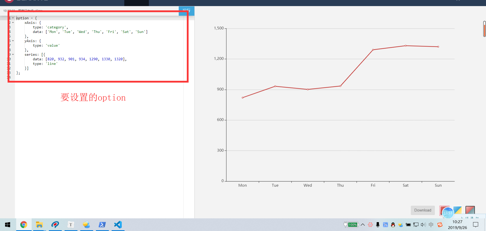

## 黑马头条PC-账户信息更新-同步到头部页面之eventBus

**`思路-步骤`**

* eventBus => event事件 Bus =>公共领域  => 公共事件池 

> 公共事件池, 假如 一辆奥迪A4牌的汽车 踩了一脚油门, 本汽车就会加速, 如果你想 你踩油门的时候,所有的车都跟着你加速 ? 

意味着 所有的车 都要监听你的 加速事件, 只要你一加速, 他们听到了你加速的声音, 他们也加速

> 要完成 以上内容, 保证有一个公共的广播区域, 这个公共广播区域就是我们的组件中 eventBus

这个公共区域的功能是什么 ? 

> 保证你能广播, 然后保证别人能听你的广播`
>
> 广播  =>  触发一个事件
>
> 听广播 => 监听一个事件

大家都在一个区域的池里,才能保证,一个人触发 ,多个人监听能够处理的同步的业务

> 也就是说,大家用的都是同一个对象, 所以说才能够实现 你说了我们听见

要借助什么对象来实现 ? 

> this.$emit()  触发一个自定义事件  这个实际上就是广播

但是你广播的位置和区域 仅仅是  **`this`**, 只能在this上监听,这也就解释了 我们子传父的时候,必须在组件的标签上写监听

> 我们可以搞一个公共的实例, 让大家都来用这个实例 监听事件, 触发事件,不就OK了吗?

代码 就两行

* ```js
  import Vue from 'vue'
  export default new Vue() // 导出一个实例 new Vue()  可以 $emit触发事件  $on 监听事件
  
  ```

导出的实例 大家都可以用 这个实例 来监听事件, 触发事件

> 怎么监听事件 

```js
eventBus.$on('selectChange', (...参数) => {}) // $on(事件名, 回调函数)  回调函数里面的参数 就是 自定义事件的参数
```

> 怎么触发事件

```js
eventBus.$emit('selectChange', ...参数) // 触发一个自定义事件 携带若干参数
```

> 任何组件的传值 都可以用eventBus, 但是 一般用于非关系型组件的传值

现在已经实现了一个eventBus, 我们只需要 在某一个位置开始监听, 在某一个位置触发即可

**`注意`** 什么时候开启监听 ?  

> 如果你在 触发事件的之后 开启监听, 是听不到的 

应该在页面初始化之后 就开启监听created函数中去听


## 黑马头条PC-左侧导航栏的折叠展开

**`思路-步骤`**

* 由头部组件触发 

> 我们需要点击右侧的图标 ,对左侧导航进行控制

头部组件也需要根据当前的状态进行相应图标的切换

* ```js
    watch: {
      collapse () {
        // 此时说明 折叠状态变了  通知左侧导航组件
        eventBus.$emit('changeCollapse') // 触发一个改变折叠状态的事件
      }
    },
```
  
  > 手下在home组件中监听
  
* ```js
  import eventBus from '@/utils/eventBus'
  export default {
    data () {
      return {
        collapse: false // 默认是展开状态
      }
    },
    created () {
      // 切换了折叠的状态
      eventBus.$on('changeCollapse', () => {
        //  此时表示 折叠状态一定变了 变成什么了 一定是跟当前的状态相反了
        this.collapse = !this.collapse // 只要取反 就和 头部的组件的状态对上
      })
    }
  }
  ```

* ```html
       <el-aside :style="{width: collapse ? '64px' : '230px'}"  style="transition:all 0.5s; background:#2e2f32">
  
  ```
  
> 接下来 ,需要让左侧导航组件根据 折叠状态进行相应的折叠和展开

```vue
<template>
  <div class='layout-aside'>
     <!-- 头部图片 -->
     <div class='title'>
         <!-- 如果img是动态的 你需要把地址转变成变量 -->
         <!-- 如果是折叠 用小图 如果是展开 用大图 -->
         
     </div>
     <!-- 导航菜单 开启路由模式 :router="true"(完整模式) router(简写模式)  -->
     <el-menu :collapse="collapse" router background-color="#323745" text-color="#adafb5">
         <!-- 子菜单 没有子菜单的 用 el-menu-item标签 -->
         <el-menu-item index='/home'>
             <i class='el-icon-s-home'></i>
             <span>首页</span>
         </el-menu-item>
         <!-- 二级菜单 需要用submenu -->
         <el-submenu index="2">
             <template slot="title">
                <i  class='el-icon-s-grid'></i>
                <span >内容管理</span>
             </template>
             <!-- 匿名插槽是二级菜单  具名插槽title是一级菜单-->
             <!-- 二级菜单项 还是使用el-menu-item -->
             <el-menu-item index='/home/publish'>发布文章</el-menu-item>
             <el-menu-item index='/home/articles'>内容列表</el-menu-item>
             <el-menu-item index='/home/comment'>评论列表</el-menu-item>
             <el-menu-item index='/home/material'>素材管理</el-menu-item>

         </el-submenu>
           <el-submenu index="3">
               <template slot="title">
                 <i class='el-icon-s-opportunity'></i>
                 <span>粉丝管理</span>
               </template>
             <!-- 二级菜单项 还是使用el-menu-item -->
             <el-menu-item index='/home/picture'>图文数据</el-menu-item>
             <el-menu-item index='/home/fansinfo'>粉丝概况</el-menu-item>
             <el-menu-item index='/home/fansphoto'>粉丝画像</el-menu-item>
             <el-menu-item index='/home/fanslist'>粉丝列表</el-menu-item>

         </el-submenu>
         <el-menu-item index='/home/account'>
             <i class="el-icon-user-solid"></i>
             <span>账户信息</span>
         </el-menu-item>
     </el-menu>
  </div>
</template>

<script>
export default {
  props: ['collapse'], // 接收父组件传出来的变量
  data () {
    return {
      bigImg: require('../../assets/img/logo_admin.png'),
      smallImg: require('../../assets/img/toutiao.png')
    }
  }
}
</script>
```


## 黑马头条PC-echarts在项目中的应用

**`思路-步骤`**

[**5 分钟上手 ECharts**]([https://www.echartsjs.com/zh/tutorial.html#5%20%E5%88%86%E9%92%9F%E4%B8%8A%E6%89%8B%20ECharts](https://www.echartsjs.com/zh/tutorial.html#5 分钟上手 ECharts)

图表 =》echarts => 百度

Vue中使用echarts =》 和Vue没关系 =》 可以在Vue中使用

1. 下载安装echarts

   ```bash
   $ npm i echarts -S
   ```

2. 需要引入echarts => 偏大 =》只在某个页面引入 =》 按需加载 =》 只会讲echarts打包到某个模块

   ```bash
   $ import echarts from 'echarts'
   ```

3. echarts 使用 需要dom元素，需要给echarts一个盒子，一般给一个div,注意！！！**`div必须有高度和宽度`**

 ```xml
 <div class='echarts'></div>
 .echarts {
     width:600px;
     height: 400px;
 }
 ```

4. 需要获取之前准备好的dom元素，对图表进行初始化，并且得到一个图表的实例对象

​    beforeCreate created beforeMount =》 里面获取不到dom元素 =》 因为页面还没渲染

mounted => 可以获取到dom元素 => **`init`**

```js 
echarts.init(dom对象)  => 得到图表的实例 => init 方法是图表的方法
```

5. 用得到的图表实例来进行图表的渲染，调用一个图表的方法 ***`setOption`*** =》 设置图表的数据、样式、配置

option => 教程实例中的数据 或者查阅API所得 =》 一般情况下 直接看教程实例即可



一旦数据发生变化，需要重新的**`setOption`**


## 黑马头条PC-async和await新异步方案应用

> PC 和 移动 

PC  =>HTML5

移动 =>HTML5 => wap网站(无线网络协议网站)

> 目前的这个时代 叫做移动互联网时代, 所有的应用和设备都首先满足于移动设备

目前来说,移动生态是最丰富的

> 原生开发 / ios/andriod 开发移动应用 =>  微信,美团,支付宝 => 操作系统  => 性能 最好的,体验
>
> web开发 => HTML5开发, wap网站的开发 =>  运行于浏览器  =>性能最烂的,体验,受制于浏览器
>
> 混合开发 => 原生开发 + web开发 => hybrid => 原生 webview(浏览器) 嵌套H5页面  比H5要强 

混合开发可以 调用 原生开发的能力    拍照/录像/录音.支付/转发

> 跨平台开发  跨安卓和ios平台  用一种开发语言 实现 两个平台都能用的原生应用程度  ReactNative
>
> Flutter (谷歌) 性能最好的
>
> weex  跨平台 
>
> 跨平台开发的是原生程序

> 小程序   微信/支付宝/百度/抖音/头条/钉钉/qq / ...
>
> 小程序生态 几乎每个公司都有自己的标准

> 快应用  国产的10大手机厂商 针对 安卓手机做的一套手机 不用安装的移动应用  前端

多端生态  

> 一次编码 多端运行

DCloud 公司 推出了 uni-app ,一次编写  八端运行,采用Vue.js语法规范

京东凹凸实验 推出 taro  一次编码 多端运行  采用vuejs语法规范

滴滴 chamelon   基于 类vue语法

Vue  +  小程序 + React


**`思路-步骤`**

* ajax回调函数 =》 回调嵌套

* promise => 回调嵌套 =》 链式调用

* async/await 异步方案的终极解决方案

  ```js
  // 回调形式调用
  $.ajax({
      url,
      data,
      success:function(result){
          $.ajax({
              data:result,
              success: function(result1){
                  $.ajax({
                      url,
                      data: result1
                })
              }
          })
      }
  })
  ```

  ```js
  // 链式调用 没有嵌套
  axios({ url, data}).then(result => {
      return  axios({
           data:result
       })
  }).then(result1 => {
       return  axios({
           data:result1
     })
  }).then(result2 => {
     return axios({ data: result2 })
  }).then(result3 => {
      return axios({ data: result3 })
  })
  ```

  ```js
  // async/await 同步形式去写代码
  axios({}).then(result=>{
    var a=1
  })
  var b=1 // 一定先执行b=1
  
  ```

  异步代码  => setTimeout /setInterval/ 请求  => 需要放入到事件队列中的函数

  同步代码 => 同步执行完毕才会去执行异步代码
  
  ```js
  setTimeout(function () {
      console.log(2)  // 
  },0)
console.log(1)
  // 先输出1  setTimeout是异步进程 肯定先执行 同步代码 再执行异步代码
```
  
**`await`** 后面要跟一个**`promise`**的方法，只有**`promise`**方法**`reslove`**之后，await下面的代码才会执行
  
  ```js
  await axios({}).then(result=>{
      var a=1
  })
  
  var b=1 // 一定先执行a=1
  ```
  
  await会造成代码的阻塞，也就是代码死了，只有reslove之后，后面的代码才能活，有办法解决这个问题，
  
  就是给await所在的function 标明一个 **`async`**的标记,async 的意思是该函数是异步函数

  ```js
  methods: {
    async  getArticles(){
     let result = await axios()  // 强制等待axios执行完毕 reslove => then /reject => catch 
        var b=1
    }，
      test () {
        this.getArticles() => 异步函数 =》 不用强制等待它里面的await执行完
          var a=1   // 先执行a=1 再执行b=1
      }
  }
  ```
  
  await 相当于将后面的**`异步函数`**强制性的变成 **`同步函数`**，后面promise的结果可以直接在前面接收

```js
        let result = await this.updateAxios() // 造成强制等待  同步写法
       this.count = result
        // 异步写法
      this.updateAxios().then(result => {
          this.count = result
          this.$message()
        })  
```

  **`await/async`** => 带来的改变就是 编程从异步变成同步了

  **`await不能滥用`** =》 await造成当前代码强制等待 如果 await下面的代码 和await执行的结果没关系，那么请不要放在await下面，可以单独拎出来形成一个方法 或者放在await上面

  ```js
  getChannels() // 获取频道
  await getArticles() // 获取文章
  this.$message()
  
  // await下面的逻辑 一定是等待着 await结果
  ```

  **`await必须和async配套使用`** => 用了await,你的父级函数必须是async函数

  await 后面的promise只有**`resolve`**了才会执行 下 面的逻辑

  如果想要捕获**`reject`** => 要在await函数外面包一层 try/catch,才能捕获异常 catch

> 接下来去尝试 把黑马头条的promise 调用 改成async/await调用

```js
 // 删除素材的方法
    async delMaterial (row) {
      //  删除之前 应该友好的问候一下 是不是需要删除 ?
      // confirm 也是promise
      await this.$confirm('您确定要删除该图片吗?', '提示')
      try {
        //  如果 确定删除  直接调用删除接口
        await this.$axios({
          method: 'delete', // 请求类型 删除
          url: `/user/images/${row.id}` // 请求地址
        })
        //  成功了应该干啥
        this.getMaterial() // 重新加载数据
      //  如果删除成功了 可以重新拉取数据 也可以 在前端删除  会在 移动端进行场景演示
      // C 端场景  如果删除 或者修改数据 不会重新拉取数据 只会在前端修改对应的一条数据
      // B 端场景 可以拉取数据
      } catch (error) {
        this.$message.error('操作失败')
      }
    },
```


## 黑马头条PC-请求模块单独优化方案

**`思路-步骤`**

* 所有的请求都在组件中
* 所有的请求都抽提出去 形成一个单独的模块，组件只是调用

> 真正的项目会拆得非常碎,请求也不例外

比如: 素材模块, 会有素材模块的请求模块,里面放置了所有的素材的请求

> 所有的请求和逻辑都是单独存放, 不放在组件中, 组件只渲染和交互

* 应该 组件中没有axios这类东西 

* export default / export 

* ```js
  export function getArticles (params) {
    return axios({
      url: API.API_ARTICLES,
      params
    })
  }
  ```

* ```js
  import { getArticles } from '../../api/articles'
  
  ```

  ```js
  export  default  obj
  ```

```js
import obj  from '路径'
```

组件和请求就完全分离了

组件只管数据展示和操作 

请求只处理请求

## 黑马头条PC-项目打包介绍

**`思路-步骤`**

* 中间过程代码 =》 html/js/css

* .vue/less=> html/js/css

* ```bash
  $ npm run build
  ```

* .vue =>{{}}/v-if/v-for/v-bind  =>  html/js/css

* 

这就是最终形态的代码 =》 上线=》 发布的就是这个 =》 webpack => 网络打包 =》 将web项目中的内容进行打包生成浏览器可识别的内容

## 黑马头条PC-打包在nodejs中运行

**`思路-步骤`**

* 阿里云服务器=》linux => ngix服务器=》nodejs服务器

通过nodejs的方式，创建http服务，以便运行打包好的项目

步骤：

1. 在桌面创建prorun目录

2. 把dist打包文件复制给prorun目录

3. 给prorun目录执行 npm init  生成 package.json文件

4. 给prorun目录执行  npm i express  安装需要的依赖包

5. 给prorun目录 创建  app.js文件 ，内容如下：

   ```js
   // 通过express创建一个http服务
   // 引入express
   var express = require('express')
   
   // 创建express实例化对象
   var app = express()
   
   // 设置dist目录被托管(运行内部的文件)
   app.use(express.static('./dist'))
   
   // 创建http服务
   app.listen(16677,function(){
     console.log('项目已经运行，具体在\n\nhttp://127.0.0.1:16677')
   })
   
   ```

   

6. 执行命令  node  app.js  运行项目

现在项目就可以执行了

